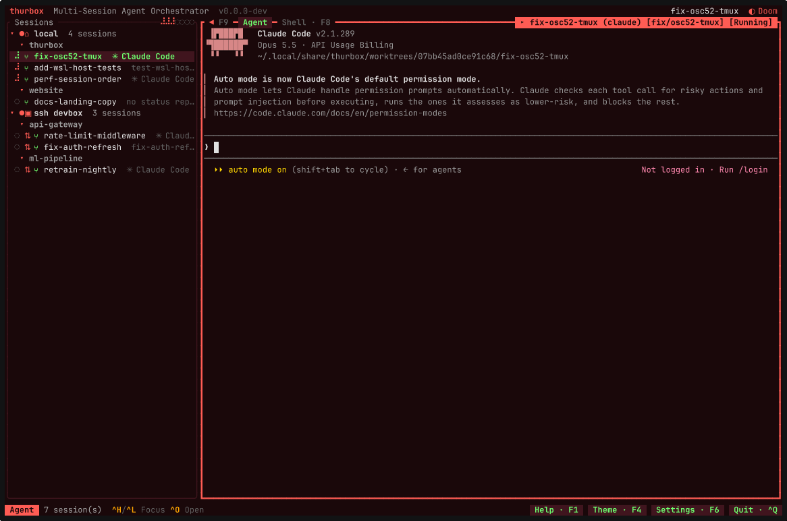
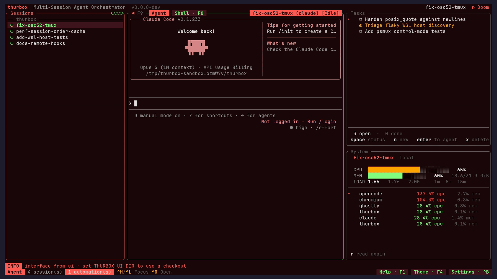

# Talos

<div align="center">
  
</div>

[](https://github.com/zatzk/talos/actions)
[](https://opensource.org/licenses/MIT)
[](https://talos.zatzk.com/)
[](https://discord.gg/fGumcHaxFY)
[](https://sonarcloud.io/summary/new_code?id=Thurbeen_talos)



- **Several coding agents at once**, side by side in one terminal — Claude Code, Codex,
  Antigravity, opencode, aider, or any CLI you describe yourself.
- **A persistent multiplexer session behind every agent** — they survive crashes, restarts
  and reboots, so quit talos and every agent keeps working.
- **Agents on other machines too** — sessions on a remote host over SSH, or in a WSL
  distro, sit in the same list under their own host, beside the ones running here.
- **One session, several repos** — put any of them on its own git worktree of a shared branch,
  so agents never fight over your checkout.
- **Agent-neutral** — talos launches the vendor CLI unmodified and knows nothing about its
  model, prompts or tools, so new agent features arrive the day that CLI ships them.
- **An interface that is not compiled in** — every pane, the session list included, is a Lua
  file in a directory you own; move it, turn it off, rewrite it, or install one somebody else
  wrote.

## Installation

**Linux / macOS:**

```bash
curl -fsSL https://raw.githubusercontent.com/zatzk/talos/main/scripts/install.sh | sh
```

**Windows (PowerShell):**

```powershell
irm https://raw.githubusercontent.com/zatzk/talos/main/scripts/install.ps1 | iex
```

That installs both binaries — `talos` (the TUI) and `talos-cli` (the
headless one) — with checksum verification and platform auto-detection.

You also need **tmux ≥ 3.2** (or [psmux](https://github.com/psmux/psmux) ≥ 3.3.7
on native Windows), **git**, and at least one coding-agent CLI.
[RMUX](https://github.com/Helvesec/rmux) **≥ 0.10.0** is an opt-in alternative,
tested with talos on Linux. Install it separately, then select **RMUX**
after tmux in the new-session picker (**Ctrl+N**); it appears locally when
`rmux` is on `PATH`. See [multiplexer requirements and setup](docs/CONFIG.md#multiplexer-requirements-and-rmux-setup)
for verified versions, config defaults, host support, and limits.

**Nix / NixOS:**

```bash
nix run github:zatzk/talos                # try it
nix profile install github:zatzk/talos    # install it
```

On NixOS, add `github:zatzk/talos` as a flake input and import
`talos.nixosModules.default` with `programs.talos.enable = true;`. The
[Installation page](https://talos.zatzk.com/docs/installation.html#nix)
has the full snippet, the overlay and the Home Manager module.

Homebrew, the AUR, winget, Chocolatey, building from source, pinning a version
and changing the install directory are all on the
[Installation page](https://talos.zatzk.com/docs/installation.html).

**Uninstall:** removing the binaries is not enough — sessions keep running in
the selected multiplexer, and talos wires hooks and a skill into your coding agents' own
directories. Follow the
[uninstall steps](https://talos.zatzk.com/docs/installation.html#uninstall).

## Your first session

```bash
talos
```

First launch seeds `~/.config/talos/` — the agents talos knows, the themes,
and the interface itself — then draws a session list on the left and an agent
terminal on the right.

1. **`Ctrl+N`** opens the repo picker. `Space` toggles a repo, `w` puts it in
   worktree mode (you are asked for a base branch and a new branch name),
   `Enter` confirms. Name the session, then pick an agent.
2. **Talk to it.** The right pane is a live agent CLI; every key goes to it.
3. **`Ctrl+N` again** for a second agent on a second branch. `Ctrl+J` / `Ctrl+K`
   move between sessions — the one you are not looking at keeps working.
4. **`Ctrl+Q`** leaves the TUI without killing anything. Run `talos` again and
   both agents are still mid-task, or attach raw with `tmux -L talos attach`.

That is the whole product in four steps: parallel work that keeps going when you
stop watching it.

`F1` lists every key and is rendered from the live registry, so it cannot drift
from what is running; `Ctrl+P` is a command palette over the same actions.
For the same walkthrough with screenshots, see the
[tutorial](https://talos.zatzk.com/docs/tutorial.html).


## What else it does

- **[Global search](https://talos.zatzk.com/docs/features.html#global-search)**
  (`Ctrl+/`) — find a session by name, agent, branch or repo, *and* by the text
  on its screen, which is the half that finds it by the error in it.
- **[Fork and lead/worker trees](https://talos.zatzk.com/docs/features.html#session-forking)**
  (`Ctrl+F`) — branch a conversation; children nest under their lead.
- **[Worktrees and multi-repo sessions](https://talos.zatzk.com/docs/features.html#git-worktrees)**
  — one session can span several repos, each on its own worktree of a shared
  branch. `Ctrl+S` syncs them with their base.
- **[Remote SSH and WSL sessions](https://talos.zatzk.com/docs/features.html#remote-ssh-sessions)**
  — declare hosts in `hosts.toml` and sessions run there while the TUI stays
  local.
- **[A headless CLI](https://talos.zatzk.com/docs/features.html#headless-cli)**
  — `talos-cli` creates, drives, captures and tears down sessions from a
  script, over the same database the TUI is reading.
- **[Automations and tasks](https://talos.zatzk.com/docs/features.html#automations)**
  — scheduled agent runs and a todo list whose items can be handed to an agent.
  A tmux heartbeat fires them whether or not talos is open.
- **[Inter-session messages](https://talos.zatzk.com/docs/features.html#inter-session-messages)**
  — an agent-neutral mailbox so one agent hands another a payload instead of
  scraping its terminal.
- **[Extensions](https://talos.zatzk.com/docs/extensions.html)** — opt-in
  add-ons that are data, not code: a manifest declares the agents, files,
  sessions and automations it wants, and one command installs and self-heals
  them.
- **[Session lifecycle hooks](https://talos.zatzk.com/docs/configuration.html#hooks-toml)**,
  **[OS notifications](https://talos.zatzk.com/docs/configuration.html#notifications)**,
  **[36 themes](https://talos.zatzk.com/docs/features.html#themes)**
  (`Ctrl+Y`) and full mouse support.

Wiring a fleet of agents at once — operators, developers, reviewers, from one
script — is the
[monorepo recipe](https://talos.zatzk.com/docs/recipes.html#monorepo).

## Make it yours

The binary boots a kernel, reads a directory, and draws whatever Lua it finds
there. Panes live in `ui/plugins/*.lua`, the arrangement in `ui/layout.lua`, and
`F10` reloads both from disk. Agents, hosts, hooks, themes, chords and settings
are each a file under `~/.config/talos/`.

You do not have to learn Lua for any of it. Talos ships a built-in `ui-skill`
extension that teaches whichever CLI you run how the interface is put together,
so from inside any session you can just ask:

> *Add a pane on the left with CPU and RAM usage. Move the search strip to the
> bottom and make the session column 30% wide.*

Press `F10` and the change is on your screen. If a pane breaks, `Ctrl+,` then
`]` is chrome rather than a pane, so it cannot be edited away — `r` restores a
shipped file, `space` turns yours off.

[The Interface →](https://talos.zatzk.com/docs/interface.html) ·
[Writing a pane →](docs/PLUGINS.md) ·
[Configuration →](https://talos.zatzk.com/docs/configuration.html)



## Documentation

[**talos.zatzk.com/docs**](https://talos.zatzk.com/docs/) is the manual:
[installation](https://talos.zatzk.com/docs/installation.html),
[tutorial](https://talos.zatzk.com/docs/tutorial.html),
[features](https://talos.zatzk.com/docs/features.html),
[keybindings](https://talos.zatzk.com/docs/keybindings.html),
[configuration](https://talos.zatzk.com/docs/configuration.html),
[agents](https://talos.zatzk.com/docs/agents.html),
[the interface](https://talos.zatzk.com/docs/interface.html),
[orchestration](https://talos.zatzk.com/docs/orchestration.html),
[architecture](https://talos.zatzk.com/docs/architecture.html),
[a comparison with similar tools](https://talos.zatzk.com/docs/comparison.html)
and an [FAQ](https://talos.zatzk.com/docs/faq.html).

The rationale behind the decisions is in this repository, under
[`docs/`](docs/): [CONSTITUTION](docs/CONSTITUTION.md) (non-negotiable
principles), [ARCHITECTURE](docs/ARCHITECTURE.md), [FEATURES](docs/FEATURES.md),
[CONFIG](docs/CONFIG.md), [KERNEL](docs/KERNEL.md),
[PLUGINS](docs/PLUGINS.md), [ORCHESTRATION](docs/ORCHESTRATION.md),
[DEVELOPMENT](docs/DEVELOPMENT.md) and [RELEASING](docs/RELEASING.md).

## Contributing

[`CONTRIBUTING.md`](CONTRIBUTING.md) is the full guide — the Nix dev shell, the
`just` tasks, the test discipline, and the conventional-commit rules that decide
what gets released.

```bash
git clone https://github.com/zatzk/talos.git
cd talos
nix develop          # or ./scripts/install-dev-tools.sh
just build && just test && just lint
```

## Community

- **[Discord](https://discord.gg/fGumcHaxFY)** — questions, setup help, and
  showing off your interface. Ask in `#help`, one thread per problem.
- **[GitHub Issues](https://github.com/zatzk/talos/issues)** — confirmed
  bugs and concrete feature requests.

## License

MIT — see [LICENSE](LICENSE). Built on
[ratatui](https://github.com/ratatui-org/ratatui),
[tui-term](https://github.com/a-kenji/tui-term),
[vt100](https://github.com/doy/vt100-rust) and
[tmux](https://github.com/tmux/tmux).
