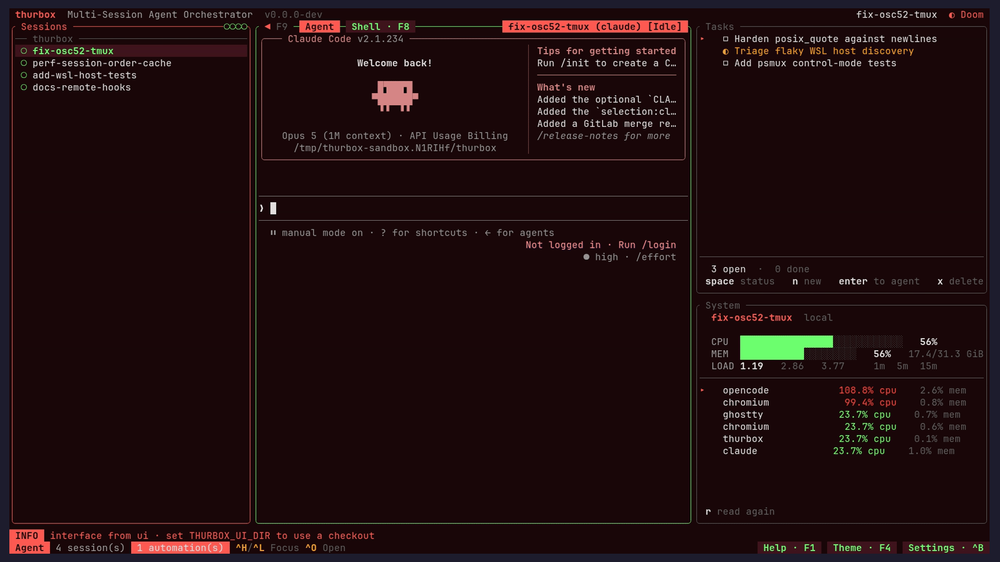
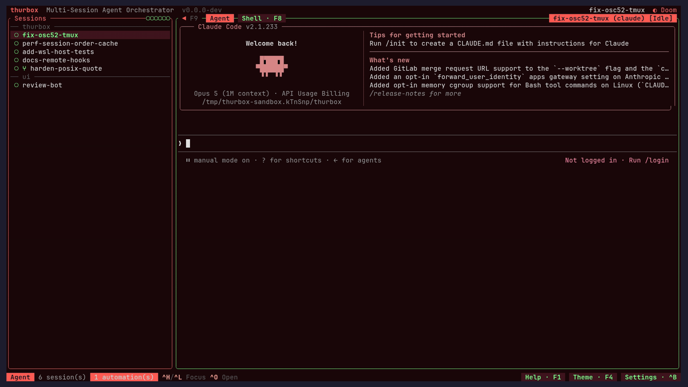

# Feature Decisions

Design rationale for user-facing behavior.
For architectural choices, see [ARCHITECTURE.md](ARCHITECTURE.md).

> **Read this first.** Much of the reasoning below was written while the interface
> was Rust (v1). The interface is now a Lua plugin kernel (ADR-23), so a section may
> describe a surface that no longer exists, or one that still exists in a plugin
> rather than in `src/ui`. Sections in the first case say so at the top; the
> *rationale* is kept either way, because it is what a plugin rebuilding that
> surface needs and it is not recoverable from the code.
>
> The engine below the interface — sessions, worktrees, agents, hosts, storage,
> extensions, the CLI — is unchanged, and so are those sections.

---

## Session Sidebar

### Single session list

The left sidebar holds a single flat list of sessions — there is no
project grouping layer above it. Sessions are top-level, identified
by a UUID v4, and labeled with their name, agent, branch (when in a
worktree), and cwd.

**Why no projects?**

- An earlier design grouped sessions under projects (one project →
  many sessions, with shared repos). In practice users tended to
  create one session per task, so the project layer was pure
  overhead: an extra navigation level, an extra creation step, and
  an extra deletion guard.
- Removing the project layer (storage migration v16 dropped
  `projects` and `project_repos`) collapses the model to "sessions
  own their own configuration". Each session picks its own agent
  and repos at creation time.

**Why a sidebar at all instead of a popup?**

- Sessions are persistent context, not transient selections. An
  always-visible list shows each session's status and live agent
  activity at a glance — useful for monitoring multiple parallel
  agent sessions.
- The sidebar fits cleanly into the existing 3-tier responsive
  layout (`<80`, `>=80`, `>=120`); a popup would require its own
  open/close keybinding and dismissal logic.

### Context menu (right-click)

A right-click on a session row selects it and opens a menu of that session's
actions where the pointer is: Open, Rename, Fork, Open in editor, Restart, Sync,
Move up, Move down, Delete, and Delete + worktree, each showing the chord bound
to it. `j`/`k` or the arrows move, `enter` or a click runs the entry, and `esc` or
a click anywhere else closes it.

A right-click on empty space is about no session, so it opens the column's
general menu instead: New
session, Restore deleted…, Sort by name, Undo delete and Hide panel. Both menus
also offer Collapse all when a host or repo group is expanded, and Expand all
when one is folded. These actions save both host and repo folds. Sort is offered
only when there are visible sessions and Undo only when there is a delete to
undo: an entry that would do nothing is left out rather than shown dead.
A right-click on a host or repo row toggles its fold, just like a left-click.
The general menu remains available on blank space.

**Why run the pane's own actions?** Each entry uses the same action path as a
bound chord, so the menu cannot drift from the keyboard: Delete still asks
first when there is work to lose, and a rebound chord shows up in the menu.
Sort, the panel toggle and undo are left out of the row menu because none of
them is about the session that was pressed.

**Why can other plugins add to a row's menu?** A plugin that owns a
per-session action would otherwise reach it only through `Ctrl+P` or a chord of
its own. It leaves its entries in `store["sessions.menu_extra"]` under its own
name, and they follow the pane's own entries after a rule. An entry whose
action nothing declares is dropped, the same rule that keeps Sort and Undo out
when they would do nothing. Its owner reads the pressed row from
the action's `args.session_id`, so it acts on the row that was clicked even if
the cursor moved. The contract is *Adding entries to the sessions menu* in
`docs/PLUGINS.md`.

**Why opened at the pointer, and closed by a click elsewhere?** That is what a
context menu is. The kernel supplies only the mechanism — the pressed cell on
`hit`, `float.at`, and `on_outside` for the float holding the pointer — so the
menu itself stays a plain Lua float (`ui/plugins/64_menu.lua`) that any pane can
fill. A terminal that keeps the right button for itself never sends the press;
see *The right button* in `docs/PLUGINS.md`.

### Fuzzy search

Searching is unified into the **global search** (`Ctrl+/`) — see the
*Global Search* section below. There is no separate per-list `/`
filter; instead the global strip highlights matches live across the
session list at once. Sessions are matched on name, agent, branch and
repository, and on every line their terminals still hold.

**Why all four fields?** Users remember sessions by whichever
attribute is most distinctive — sometimes the branch name, often
the agent ("the codex one"), occasionally the repo path. Indexing
all four makes the search hit on the first attempt without forcing
the user to remember which field to type into.

### Live status & "needs attention"

Each row is a single line: `<status-dot> <name> [<agent-status>]`
(worktree sessions get a `⑂` mark before the name). The agent's live
activity title (the OSC `0`/`1`/`2` window title it sets, e.g. Gemini's
`◇ Ready`) is appended after the name when present, muted and truncated
with `…` to fit the panel. The repo/branch and agent live in the info
panel, not the list row.

The colored **status dot** is driven by **agent hooks**, not output
heuristics. Each agent CLI's lifecycle hooks call `talos-cli session
signal --state <working|blocked|done|idle>` (identity from the injected
`TALOS_SESSION`), and the read-time folds in `session::hook_status` map the
persisted columns onto a `SessionState` once per tick:

| State | Colour | Glyph | Meaning |
|-------|--------|-------|---------|
| `working` | yellow | braille spinner (`⠋⠙⠹…`; static `◐`) | agent is actively running |
| `blocked` | red | `◆` | agent needs input or approval |
| `done` | blue | `●` | a turn just finished; shown until you switch away |
| `idle` | green | `○` | acknowledged, never active, or at rest |
| `unreachable` | muted grey | `⊘` | remote host is down/offline; placeholder row awaiting reconnect |
| `running` | accent | `◉`, spinner while its pane prints | an agent holds the pane and nothing has signalled — observed, never a claim about the turn |
| `uncovered` | muted grey | `◌` | this agent is wired to report nothing, so its silence means nothing |
| `unreported` | muted grey | `◌` | the agent *can* report and has not yet |

Those last three are drawn apart from `idle` on purpose, and it took a bug to
prove why: the interface derived its dot from the hook columns alone, so a
session a harness had launched an agent into — nothing wired, nothing signalled
— drew the green hollow circle while the agent worked. `idle` says *the agent
reported that it is at rest*; none of the three does. `stopped` (parked by
`session stop`) is the one word with no dot of its own, because a parked
session is at rest by definition.

One enum, so `session get`, `session list`, `talos-cli watch` and the session
list cannot disagree about a row — and since the interface has to answer
`running`, it probes what holds each unreported session's pane. That probe
shells out, so it runs on a worker thread and only for rows whose agent has
reported nothing (`kernel::snapshot::PaneProbe`); a session whose hooks work
costs nothing.

A `Done` session becomes `Idle` once you move focus off it (you've
acknowledged it); a `working` session that goes quiet for 10 s is
treated as `Idle` so an interrupted turn never spins forever. A `blocked`
session is never time-gated the same way — a standing request for input
says nothing about output — but one the agent quietly resolved itself
(no hook clears a heuristic `blocked`) is retired the same way once the
pane is caught printing well past the block edge, so a finished turn does
not read `blocked` for the rest of the session's life; see the
`talos-session-status` skill's *Latched-`blocked` fallback* for the
evidence this relies on. A remote
session whose host is unreachable is shown as a **placeholder** tagged
`Unreachable` — it never silently vanishes from the list, and the host
is retried in the background (or on demand via restart) until the session
reconnects and adopts in place. This covers both a host that is down at
restore *and* a live session whose host dies mid-run (detected via the
control-mode connection dropping). Status only **recolors** the dot — the
manual order is never disturbed (see *Smart ordering* below). Repo groups
roll up to their most-urgent member
(`Blocked > Working > Done > Unreachable > Idle`).

The hooks are wired automatically by the built-in **hooks** extension
(auto-activated on first run; opt out with `talos-cli extension
deactivate hooks`). How much each agent can report depends on the
lifecycle surface its CLI exposes — claude, codex, opencode, and
antigravity report the full range, aider reports blocked, and vibe
reports everything but blocked. See the per-agent matrix in
`extensions/hooks/README.md` (and the website's *Agent hooks* page).

**Remote sessions report status too** (same per-agent range): at spawn
time the hook commands are rewritten to the command the row's backend
reports state through (on tmux, the `@talos_state` pane user option;
ADR-32) and each agent's hook config is shipped to the host —
claude's via its `--settings` arg, the config-dir agents via
`session_ops::remote_hooks` provisioning (probe → prune-then-merge or
managed-file write, best-effort). The local TUI receives changes over its
control-mode connection (a format subscription on tmux hosts; a 1 s
pane-option poller on psmux hosts, armed once the psmux adapter's status
channel is opened). With the TUI closed, the headless `automation tick`
(60 s heartbeat) asks the backend of every route with live sessions for its
panes' states and writes changed ones into the same DB columns, so status
never freezes at its last pushed value — and a route that cannot answer
keeps its state rather than reading as idle. When wiring is
degraded (host
unreachable mid-provision, a user-owned file refused, or the
still-gated psmux provisioning), the session shows a `Hooks: degraded`
row in the info panel instead of silently idling. See the
`talos-remote-hosts` skill for the full pipeline.

#### Reading the state headlessly, and judging it

`hook_state` is **latched**: whatever was written last, by an agent that
may since have crashed, been interrupted, or never have been wired to
report at all. In the TUI that is handled by derivation — output
quiescence retires a stuck `working`, an attach failure reads as
`Unreachable` — but both need a live pane and a render loop, so neither
exists for a headless reader.

`session get`/`list --json` therefore report the raw `hook_state`
alongside everything it takes to judge it: `hook_state_at` and
`hook_state_age_secs` (when, and how long ago), `hook_reported`
(whether anything has *ever* reported — silence is not idle),
`hook_coverage` / `hook_states_reportable` / `hook_delivery` (what this
agent can report at all, so `aider`'s silence about `working` is known
to mean nothing), and `hook_blocked_is_heuristic` (claude's and
antigravity's `blocked` is a text match on a notification body, and so
stops working silently if the agent rewords one).

There is deliberately **no staleness timeout** on the headless path. A
turn may legitimately run for an hour, so a guessed bound would report
live work as finished; the age is published and the policy is the
consumer's.

The decisive check is the pane rather than the clock. `session get`
resolves the pane's true foreground process (one multiplexer query plus
one `ps`) and reports `hook_corroboration` — `agent`, `foreign-agent`,
`shell`, `other`, `dead`, `unknown`, or `unavailable` — plus
`hook_state_contradicted`, which is true when a `working` or `blocked`
row sits over a pane holding a bare shell or nothing at all. It is
**reported, never applied**: `hook_state` keeps exactly the value the
agent wrote, because overwriting a report with an inference is how a
state becomes unfalsifiable. `session list` skips the probe unless
`--verify` is passed, since the cost is per session; a remote session is
never probed (its pane is on its own host's multiplexer) and answers
`unavailable`.

**An agent talos did not launch is still seen.** A harness that owns
the agent launch itself asks talos for a bare interactive shell and
starts the agent inside that pane, so no hooks are wired and nothing
ever signals. Such a session reports `state: "running"` with
`state_source: "process"` and `hook_corroboration: "foreign-agent"` —
coarser than a hook by design, since process inspection can say an agent
is there but never what it is doing. The precise route for such a
harness is `talos-cli session signal` itself: `TALOS_SESSION` is in
the pane's environment and every child inherits it, so the call needs no
arguments (see *Inter-session messages* for the same identity contract).

**`talos-cli session doctor [uuid]`** is the diagnostic, in the spirit
of `notify --test`: is the hooks extension active, does this agent have
coverage, is its payload really on disk where the agent reads it, could
a hook command resolve `talos-cli` on the **pane's own** `PATH` at all
(the pane's, because that is the one a hook runs against — answering
with the `PATH` `doctor` itself was run on is how it once reported
healthy wiring for panes that could find no binary), what was last
reported and when, and does the pane agree. Every shipped hook command
ends in `|| true`, so a signal that never lands is otherwise
indistinguishable from an agent that has not signalled — this is how to
tell them apart. It reads without ever repairing (`talos-cli
extension reinstall hooks` is the repair), and exits non-zero when a
session's wiring is broken. An agent talos ships no hooks for but
which is signalling anyway — a driver calling `session signal` itself —
is a warning, not a failure: state is demonstrably arriving.

### Smart ordering & repo groups

The list is **grouped by repository** under subtle headers
(`── webapp ─────`), and within a group sessions follow their **manual
order** (`display_order`, see *Manual ordering* below). Manual order is
authoritative: once a row has been placed, a status change only
**recolors its dot**, it never moves the row. Sessions that were never
moved fall back to creation order:

- Sessions with no manual order render after ordered ones in stable
  insertion order. `Busy` and `Waiting` deliberately **share one
  "running" status**: a live agent flickers across the ~1s output
  boundary every tick, so they share a single dot colour rather than
  jittering between two. Ordering is a pure function of *manual order*
  and *stable order*, never of live timing — so the list never re-sorts
  itself, even when a session needs attention or exits.
- Groups are ordered by their **lowest member `display_order`**, then by name
  for determinism — so moving a session to the top of its group can pull the
  whole group up, but a status change never reshuffles the groups.
- The group key is the **set of repos a session spans** (order-independent), so
  a multi-repo session forms its own group with a combined repo row
  (`webapp + infra`) rather than being filed arbitrarily under one repo;
  sessions touching the same set cluster together. Sessions with no repo share a
  `(no repo)` group.
- With `group_by_host` on (settings → Sessions, on by default), local sessions
  stay at the top under a `local` host row. Remote hosts follow in their own
  rows. Every host row can be folded with `h`, unfolded with `l`, or toggled by
  clicking it with either mouse button or pressing Enter. A double-click
  toggles once. A folded row shows the session and active counts; `!` marks
  sessions needing attention beside the host name. Up/down navigation skips the hidden sessions. Searching
  temporarily reveals them; Esc restores the fold, while accepting a hit
  unfolds its host so the selected session stays visible.
  Folded host names are saved in the `sessions.folded_hosts` plugin setting, so
  they survive a restart. The host uses Nerd Font `` when the active theme
  enables Nerd Font glyphs, and `▣` otherwise. SSH, WSL and Windows hosts have
  text labels, and a status glyph and theme colour convey reachability.
  A local-only list also has a foldable host row.
- With `group_by_repo` on, each repo set has a selectable row within its host.
  Its fold state is independent of the host fold and of the same repo on another
  host. `h` and `l` act on a selected repo row; Enter, a click (a double-click
  toggles once) and a right-click toggle it. Search
  temporarily reveals folded sessions, and accepting a result unfolds its repo.
  Folded repo identities are saved in `sessions.folded_repos`.

**Why local has a host row.** Local work can be folded by the same gesture as
remote work. It stays first, and the cursor initially selects the first session
instead of the host handle. A creation in flight also gets its host handle.

**Why a second switch and not one choice row.** `none / repo / host / host then
repo` would read as one decision, and the settings modal cannot render it: a
plugin's values are `Bool`, `Number` and `Text`, and a `Text` row is free text
you type into — cycling a fixed set is wired to the core rows' one enum, not
declared. So the row would be a box where a misspelling silently means "none",
and it would first need a choice type in the registry, in the Lua declaration
and in the modal. The two switches are independent axes rather than two
spellings of one: all four combinations render — one flat list, repos, hosts,
and repo groups inside hosts — so no pair of values contradicts.

**Why group by repo?** With several parallel agents the dominant question
is "which project is this?" — clustering same-repo sessions answers it at a
glance, and a stable manual order means a row stays where you put it (a
blinking status dot still flags urgency without yanking the row around). A
single comparator (`ui::project_list::compute_session_order`) drives both
rendering and `Ctrl+J`/`Ctrl+K` navigation, so the keyboard always steps
through the exact order shown.

**Why signals instead of guessing?** Pure output-timing can only say
"quiet for >1s"; it can't tell a thinking pause from "done" or "needs
you". The agents already emit these signals — we just read them. This
mirrors how dashboards like Orca surface working / waiting / finished.

**Caveat (Claude in tmux):** Claude Code only emits the OSC 9 desktop
notification for Ghostty/Kitty/iTerm2, so inside talos's tmux pane
set `claude config set --global preferredNotifChannel terminal_bell`
to get the bell we can detect. We capture bell + OSC 9 + OSC 777,
whichever the agent produces.

### Manual ordering & alphabetical sort

The list is manually orderable. With the session list focused,
`Shift+J`/`Shift+K` move the selected session one row down/up
(rebindable `SessionListMoveDown`/`SessionListMoveUp`). A move swaps two
adjacent **blocks** — a row plus its nested children, so a parent drags
its whole subtree: root rows swap within their repo group, the **whole
group** swaps past a group edge, and nested children move among their
siblings only. `Shift+S` (rebindable `SessionListSortAlphabetically`)
sorts every group's sessions alphabetically by name in one shot,
preserving group order and parent/child nesting.

**A session being created is a row with no name to sort by.** The
placeholder the list draws while a creation is in flight is its own root
block carrying the command, not a session, so `Shift+S` holds it out of
the comparison and puts it back at its group's end — where the list
already draws it, and where the real row appears once the creation
lands. Ordering it under an empty name instead would pull it above every
session it is queued behind, and reading a name off it at all is what
crashed the pane the moment a group held both a session and a
placeholder (issue #1200).

**A group never moves onto another machine.** With the host axis on, the group
below the last of one host's belongs to the next host, and `Shift+J` there is
refused rather than swapping them. The swap would be accepted, persisted, and
then undone by the next build re-clustering each group under its own host —
the same shape as the `group_by_repo` mistake below. Here it cannot be argued
for either way: which machine a session runs on is `backend_type`, grouping is
a view, and a view never moves a session between them. With `group_by_host`
off there are no host edges to refuse at, exactly as `group_by_repo` off
leaves no repo edges.

**With grouping off there are no group edges.** The session list's
`group_by_repo` setting (settings → Sessions) is not a label switch: off
means the list is genuinely one flat group ordered by `display_order`
alone, so `Shift+J`/`Shift+K` move a row one place anywhere in the list
and `Shift+S` sorts the whole thing. Suppressing only the header line
and keeping the clustering was the first shape and it was wrong — a move
that carried a session past a repo boundary was accepted, persisted, and
then undone by the next build re-clustering it under its own repo, with
the headers that would have explained it turned off. Parent/child
nesting is unaffected either way: it is not a repo property.

Both paths densely renumber every session's `display_order` `0..n` and
persist it, so the order survives restarts and syncs across instances
via the existing `data_version` polling. The pure helpers
(`ui::project_list::move_in_order` / `sort_alphabetically_within_groups`)
back `App::move_active_session` / `sort_sessions_alphabetically`; storage
is the nullable `sessions.display_order` column (schema v31, `None` =
never moved).

**Why manual order wins over status.** Earlier the list re-sorted itself
by status, which meant a row jumped around under your cursor every time
an agent finished or started thinking. Letting the user pin the order —
and only recoloring the status dot in place — keeps the list a stable
spatial map you can build muscle memory against.

---

## Session Creation



`Ctrl+N` walks through a series of modals to configure a new
session. Each step has a sensible default and can be skipped when
not applicable.

1. **Host picker** — choose where the session runs: `local`, or any
   SSH or WSL host defined in `hosts.toml`. Skipped entirely when no
   remote hosts are configured (preserving the local-only flow). For
   a remote host the repo picker shows the repos previously used *on
   that host* (bookmarks are host-scoped, schema v39) and every remote
   filesystem touch — the path browser's listings, Enter validation,
   `Alt+P` parent scans and their periodic re-scan — runs on a worker,
   never blocking the UI on a host round trip; the worktree and multiplexer
   window are created on that host through its configured transport.
2. **Multiplexer picker** — choose a backend offered on that host. The
   configured choice or platform default stays selected. An unavailable
   configured choice requires an explicit replacement selection. RMUX sits next
   to tmux; locally it appears only when `rmux` resolves on `PATH`. A choice
   stays tied to its backend name when the available list refreshes.
3. **Repo picker** — fuzzy-searchable list of bookmarked repo
   paths. `Space` toggles selection, `w` marks the selected repo
   as a worktree base (refused on a known non-git dir, which is
   still selectable as a plain member and rendered with a dim
   `(dir)` tag), `d` deletes the bookmark, and a path-input field
   adds new bookmarks: `Tab` accepts the inline autocomplete
   suggestion, or — with nothing to complete — opens a **path
   browser** dropdown listing the typed directory (git repos marked
   `●git`; `Enter` descends into a plain dir or picks a repo
   directly, `Esc` closes it, listings are cached per picker).
   Remote paths expand `~` against the remote home and are verified
   (exists + is-it-git, one round trip, async with a `checking…`
   spinner) on Enter; git-ness is persisted per bookmark (schema
   v40) so it's learned once. The first selected repo becomes the
   session's `cwd`; the rest may be exposed to the agent depending
   on the agent's own flags.

   **A folder imported with `Alt+P` is a scan, not a snapshot.** Its
   members are whatever it holds *now*, so a repository cloned into
   it appears and one deleted from it stops being offered, with no
   re-import. A **local** folder is scanned on every bookmark read
   (a `readdir`, so free). A **remote** one is scanned on its host
   every 30 s while the picker is open, on a worker, and what it
   finds is written back to the bookmark rows — which is what the
   folder still shows across a restart and while the host is
   unreachable. A scan that *fails* changes nothing: an unreachable
   host, or a folder that can't be read, leaves it holding what it
   last held rather than emptying it. A folder that reads as *empty*
   is empty — the same answer as deleting the last repository in it,
   which is half of what the rescan is for. So a folder imported from
   a mount point goes empty while its drive is unmounted (an unmounted
   mount point is a readable empty directory) and refills when it
   comes back.

   **Worktrees the repo already has** appear as `↳` child rows under
   whichever repo the cursor is resting on, each showing its directory
   name and the branch checked out there. They come from
   `git worktree list --porcelain` on that repo — so a worktree made
   *outside* talos is found wherever it lives (`.worktrees/`, a
   sibling directory, anywhere), not just at talos's own derived
   `<repo-hash>/<branch>` path. One git call per highlighted row, cached
   with the same TTL as the branch list; the main checkout, bare repos,
   detached heads and prunable registrations are dropped, since no
   session can be started on them. `Enter` on one **opens** it: no
   `git worktree add` runs, and steps 4–6 below are skipped entirely
   (the branch is the one already checked out there, and the session is
   named after the worktree *directory* — an agent that cuts
   `.worktrees/dynamic-tooltips` on branch
   `feat/dynamic-tooltips-15307729713678226529` gives you a session
   called `dynamic-tooltips`, not the suffix).
4. **Base branch selector** — worktree mode only.
5. **Session name** — free text identifier shown in the sidebar.
6. **New branch name** — worktree mode only.
7. **Agent picker** — choose which coding agent runs in this
   session. Skipped when only one agent is defined in
   `agents.toml`. An agent whose `command` resolves nowhere on `PATH`
   is marked `⚠ not installed` on its own row, so the cost of the
   choice is visible while the cursor is still moving over the
   alternatives.

**The flow says what is missing before you commit.** talos starts with no
multiplexer and no agent installed — that is deliberate, and browsing and
configuring keep working — but it used to mean the check landed at the worst
possible moment: you committed to a session and got back a number
(`tmux new-window exited exit status: 127`), naming neither the binary, nor
where talos looked, nor what to install. Now the flow already knows. A missing
multiplexer is stated from the flow's **first** step, because nothing can be
created without it; a missing agent is stated on the step that offers it. Never
a modal that blocks — a `command` may still be launchable (a shell function, or
something installed a second later), so the answer is a warning on the choice,
not a refusal of it. The empty session list carries the same line, since that is
the one screen a first run always reaches, and `talos-cli doctor` answers the
whole question directly. See
[CONFIG.md](CONFIG.md#what-happens-when-it-is-not-installed) for the cost model
(a `stat` walk on the kernel's schedule behind a 10-second window — never on a
render, a keystroke or a list row) and for why a remote host or a relative
`command` is reported as *unknown* rather than missing.

**A spawn's verdict is the pane id, not the exit status.** The other thing that
answers 127 is the multiplexer itself, and it is not about the agent at all:
tmux hands a command-mode client the status of the last `run-shell` its command
list triggered, and a *hook* counts. An `after-new-window` hook left behind by
an uninstalled tmux plugin calls a script that is no longer on the disk,
`/bin/sh` answers 127, and the client exits 127 although the window was created
and its pane id already printed — with nothing on stderr to say so. So the
answer to `-P` outranks the status: where there is a pane id the window exists
and the session keeps it, with a warning that a hook failed and that
`show-hooks -g` on that socket names which (unset it; the server holding it
holds every live session too, so it is not one to kill). Only a failure with no pane id
is a failure. This is also why the same server could refuse to create a session
and serve everything else — a restart, a plugin program, the companion shell
pane all go over control mode, whose reply block carries the `-P` answer alone
and no exit status to misread.

**Creating a session moves nothing — unless you ask it to.** By default the new
row appears in the list and waits to be picked; the selection, the pane showing
it and the keyboard all stay where they were. Creation is a command that
finishes on a worker seconds after the flow closed, so the moment it lands is
not a moment the user chose — steering the view then interrupted whatever they
had gone back to reading, and made creating three sessions in a row a fight with
the cursor. `Ctrl+F` fork behaves the same way. Selection is still *steerable*,
by the two requests that are deliberate: a clicked notification and
`talos-cli session focus`, both through `focus_session`, which the list
follows by id rather than by row number.

**A session appearing or going away moves nothing either** — which used to be
this promise's weak half. The list's cursor was a row *number* restored from
`state`, and only a follow, a foreign `store.selected` write or a `focus_session`
request ever remapped it onto an id, so an ordinary rebuild kept the number: a
session opening or closing *above* the cursor renumbered every row below it and
slid a different session under the highlight and into the agent pane, while the
keyboard stayed where it was (issue #1211). Nothing had to be created *by this
interface* for that to happen, which is why a fleet — opening and closing
sessions constantly and without warning — hit it hardest. So the selection is
the **session**, not its row: `ui.cursor` writes down which item is selected and
re-derives the row from it on every build.

The row number is kept for exactly one case, the selected session no longer being
in the list, and then the cursor lands on **whatever now occupies that
position** — the neighbour below it, or the list's last row once the list is
shorter than the cursor. Not the top, which is a second theft of the same kind,
and not nothing, which would blank the agent pane over a session the operator
never closed. It is also the answer the model already assumed: a row dropped by
`session_model.build` is dropped before anything is grouped or ordered, so that
the cursor lands on the next row.

Not having to hunt for the row you just asked for is worth that interruption to
some people, so it is **a setting rather than a decision**: the session list's
`focus_new_session` (settings → Sessions, off by default) makes a create or a
fork select the new session and give the agent pane the keyboard, exactly as
`Enter` on its row would. It is the *list's* setting rather than a core one
because the list owns the selection — it subscribes to `session.post_create`
and does there what `Enter` does. That event fires only for a create **this
interface** performed, which is what keeps a `talos-cli session create`, an
automation or a second instance from taking the keyboard out from under you;
and the cursor only *follows* the new id, so moving it yourself in the meantime
wins.

A session is fully described by its repos and agent. There is no
per-session model selection, permissions, prompt, tool, or skill
configuration — those concerns belong to the agent CLI itself,
which runs with its own default config.

**Why per-session repo selection?** Each session is its own context,
so it makes sense to pick repos at creation time rather than
inheriting from a parent grouping. Mixed sessions are supported:
some repos may be worktree-based (new branch created) while others
are added as-is.

**How does one agent reach multiple repos?** Agent CLIs disagree on
how (or whether) to accept extra directories, so talos stays
agent-neutral: a multi-repo session is launched in a per-session
**symlink workspace** (`~/.local/share/talos/workspaces/<id>/`)
holding one symlink per repo, with the agent's cwd set there. Every
agent then sees each repo as a subdirectory — no per-agent flags and
no `agents.toml` changes. The workspace is only symlinks, rebuilt
idempotently on each launch and removed (without touching the repos)
when the session is deleted. Single-repo sessions launch directly in
the repo as before.

**Headless multi-repo.** The same shape is reachable without the TUI.
`talos-cli session create` (and `task create`) take repeatable
`--add-repo PATH[@BASE]` — each gets its **own isolated worktree** on
the spawn's shared `--worktree-branch`, off its own base — and `--add-dir
PATH`, which attaches a repo **as-is** (no branch). A spawn with two or
more members lands in the same symlink workspace the TUI builds, so every
agent sees each repo as a subdirectory. The extra-repo list is persisted
as JSON (schema v33) so a restored session rebuilds the identical
workspace.

**Why per-session agent?** Different tasks suit different agents.
Choosing the agent at creation time keeps each session
self-describing and lets you mix agents across the sidebar
(Claude here, Codex there) with no shared global configuration.

**Why a bookmark list rather than a path picker every time?** Users
work on the same handful of repos repeatedly. Bookmarks make the
common case a 2-keystroke selection while still allowing arbitrary
paths via the input field. Bookmark deletion (`d`) keeps the list
from accumulating stale entries.

### Agent definitions

The set of available agents is **data**, not code. On first run
Talos seeds `~/.config/talos/agents.toml` with built-in
definitions for claude, codex, antigravity, opencode, aider, copilot,
vibe, and pi (`agent::agent_config::load_or_seed`). Editing the file —
adding an `[[agents]]` entry or tweaking an existing one — extends the
agent picker with no recompile. Each built-in's exact config and
behavior (and the checklist for adding a new built-in) is in
[AGENTS.md](AGENTS.md).

Each definition (`session::AgentDef`) carries:

- `name` — display + lookup key, unique in the registry.
- `command` — the CLI executable to launch.
- argument-template groups: `args` (always passed — bake in flags
  like a model here if you want) and `resume_args` / `fork_args` /
  `new_session_args` (with `{id}`).
- `resume_latest` — when true, restart resumes the agent's most
  recent session in the launch directory via **id-less** flags
  (see below).

`agent::GenericProvider` builds the launch arguments by appending
each group **only when its driving value is present**, substituting
`{id}` token-by-token. Selection precedence is fork > resume >
new-session id; static `args` follow. A group with no value is
simply omitted — no unresolved-placeholder heuristics.

Only `claude` and `pi` accept the talos-generated id at creation
(`--session-id {id}`), so they resume/fork by that exact id. Codex
reports its own ID through `SessionStart`; talos saves it for exact
`resume {id}` and `fork {id}`. Legacy or ambiguous rows use Codex's interactive
picker, including for forks. The remaining built-ins use
`resume_latest = true` and id-less, cwd-scoped flags
(`opencode --continue`, `agy --continue`, `aider --restore-chat-history`); the agent
resolves "the last session in this directory" itself, which works
because restart reuses the session cwd and a single-repo fork reuses
the parent cwd. Agents that declare no `resume_args` start fresh on
restart instead of resuming.

Example:

```toml
default = "claude"

[[agents]]
name = "claude"
command = "claude"
resume_args = ["--resume", "{id}"]
fork_args = ["--resume", "{id}", "--fork-session"]
new_session_args = ["--session-id", "{id}"]

[[agents]]
name = "codex"
command = "codex"
resume_args = ["resume", "--last"]   # id-less: last session in cwd
fork_args = ["fork", "--last"]
resume_latest = true
```

### Remote SSH & WSL sessions

Like agents, off-local hosts are **data**. A session can run on a
remote machine over SSH, or inside a local **WSL distro**, while the
TUI stays local. Hosts are declared in
`~/.config/talos/hosts.toml` (seeded commented-out, so a fresh
install has none and behaves exactly as before) — **and WSL distros
are auto-discovered** (`wsl.exe -l -q`), so they need no entry at all.
Running talos *inside* a distro discovers its siblings but not the
distro itself: that one is this machine, and its sessions are plain
local ones.

```toml
[[hosts]]
name = "devbox"            # selectable as backend "ssh:devbox"
destination = "me@devbox"  # resolved via ~/.ssh/config
ssh_opts = ["-o", "ControlMaster=auto", "-o", "ControlPersist=10m"]

# Only needed to override an auto-discovered WSL distro's defaults:
[[hosts]]
name = "ubuntu"            # selectable as backend "wsl:ubuntu"
kind = "wsl"
distro = "Ubuntu-22.04"    # defaults to `name`
```

Each `[[hosts]]` entry (`session::HostDef`) — the seeded `hosts.toml`
documents each field inline:

| Field | Required | Default | Meaning |
|-------|----------|---------|---------|
| `name` | yes | — | unique id; registers the backend `ssh:<name>` / `wsl:<name>` and is what `--host` expects |
| `kind` | no | `ssh` | transport: `ssh` (remote machine) or `wsl` (local distro) |
| `destination` | for ssh | — | ssh target (`user@host` or a `~/.ssh/config` alias) |
| `distro` | no | `name` | WSL distro name (`kind = "wsl"` only) |
| `ssh_opts` | no | `[]` | extra `ssh` flags, one token per array element; no `~` expansion (use absolute paths) |
| `socket` | no | `talos` | host `tmux -L` socket name |
| `session` | no | `talos` | host tmux session name |
| `worktrees_dir` | no | `$HOME/.local/share/talos/worktrees` | absolute dir on the host/distro for git worktrees |
| `share_sessions` | no | `true` | the host's database is the record of its sessions (see **Shared sessions** below); `false` drives the host from here as before |

Each host becomes a session backend named `ssh:<name>` / `wsl:<name>`.
For **SSH**, talos shells out to the system `ssh` binary, so
authentication, keys, and connection multiplexing come from your
`~/.ssh/config` — talos never handles credentials. A **WSL distro**
is reached with `wsl.exe -d <distro>` (no credentials, no network);
`wsl.exe` forwards whitespace-free tokens to the in-distro shell like
`ssh` does, so the *same* tmux control-mode protocol, POSIX quoting,
and worktree layout apply — only the launch prefix differs (multi-word
`sh -c` scripts go through `wsl.exe --exec`, which hands argv over
verbatim; see `shell::wsl_command`). `wsl.exe` is started off the
interface's terminal, or an attached WSL session takes the keyboard —
ADR-13. So off-local
sessions get identical persistence, multi-instance sharing, and
restore-on-startup as local ones; the worktree and agent process live
on the remote host / inside the distro (a WSL distro's worktrees stay
in its own Linux filesystem, not on `/mnt/c`). In the session list an
off-local session is marked with a `☁` glyph (and the info panel shows
its `Host:`), mirroring the worktree `⑂` mark.

**Why a config file rather than ad-hoc destinations?** Named hosts
give the picker stable, readable entries and let `backend_type`
round-trip cleanly through the database so a remote session re-adopts
on the correct host after a restart.

**Why lean on `~/.ssh/config`?** Re-implementing SSH auth, agent
forwarding, and ControlMaster multiplexing would be a large, fragile
surface. Deferring to the system `ssh` keeps talos out of the
credential path and inherits whatever the user already configured.

Headless: `talos-cli session create --host devbox --repo-path
/srv/repo --worktree-branch feat/x` does the same over the CLI.

#### Shared sessions: the host's database is the record

A session that runs on a host is a row in **that host's** talos
database, whoever created it — a talos running on the host and one
reaching it as `ssh:<name>` see the same list, and either side can
create, delete, restart or restore. ADR-24 in `docs/ARCHITECTURE.md`
has the rationale; the shape:

- **Mirror.** A remote talos mirrors the host's `session list
  --json` (and `--deleted`) into local rows on `ssh:<name>` — same id,
  the host's facts and hook status — every 10 s from a worker, right
  after anything it delegated, and from the headless `automation tick`.
  `talos-cli session sync [--host <name>]` runs one pass by hand.
  What is the observer's stays the observer's: display order, the
  companion shell. A pass that changes nothing writes nothing.
- **Hosts of hosts.** A host that mirrors hosts of its own lists their
  sessions too, under *its* `ssh:`/`wsl:` names — so A reaching B, with
  B reaching C, sees C's sessions through B. A session keeps its id on
  every hop, so the id is its identity and each row is one path to it:
  a session is listed **once**, and a pass through B only takes a
  session this instance holds on no other path. A → C directly wins —
  C's own pass relabels a row B's pass took first, and B's pass never
  takes it back — and a host that mirrors this instance back never
  relabels this instance's own sessions as its. Delete, restart,
  `send` and `key` on a row seen through B go to B's CLI, which
  delegates in turn to C. Such a row carries **no pane** (the id B
  reports is a pane on C's server, and on B's it would be another
  agent), so its terminal is not attached here; its checkouts are
  listed but marked borrowed, so no teardown run on B removes them.
  `[remote] transitive_sessions = false` in `settings.toml` lists only
  each host's own sessions, and the next pass forgets the rows it took
  on — dropped, not deleted, so nothing reaches the session's owner and
  turning it back on brings them back.
- **Delegation.** Create, delete (soft or forced), restart and restore
  on a shareable host run `talos-cli session …` *on the host*, which
  does the worktree, the hooks and the launch with the host's own
  `agents.toml` and `hooks.toml` and mints the id. Every caller goes
  through the same four `session_ops` pipelines, so the creation flow,
  the CLI, `spawn` automations and extension self-heal all delegate.
  The caller's own `hooks.toml` fires around the delegated call with
  `TALOS_HOST` set; the host's fires there. A refusal on the host is
  the caller's error, verbatim.
- **Provisioning.** On first use, talos looks for a `talos-cli` of
  the same major — first the one a talos running *on the host*
  advertises (every talos links its own CLI at
  `<data dir>/bin/talos-cli` at start and on each CLI call, which is
  what makes a host running a **dev checkout** shareable at all: its
  `target/debug/talos-cli` is on nobody's PATH — the link is only ever
  written over a symlink of talos's own, and never when the running
  CLI *is* that path, which on a provisioned host it is), then PATH and
  `~/.local/bin`. When
  there is none, it downloads the release archive of **its own
  version** for the host's platform, verifies it against the release
  checksums, and places `talos-cli` under
  `~/.local/share/talos/bin/` on the host (`talos-dev/bin/` for a
  dev build, which then uses the host's `talos-dev` database and
  socket — dev and release stay as separate there as they are locally)
  — never on PATH; an install the user makes later wins. That first
  session creates the
  host's database at the standard location, so a later full install
  finds every session already there. A dev build ships its own sibling
  binary when the host is the same platform and refuses otherwise.
  However it got there, the binary is **asked for its version before
  any of it is reported as provisioned**: the archive is checksummed
  here, nothing checksums what lands on the host, and a `talos-cli`
  that was 54% of itself was installed, logged as provisioned and left
  to segfault.
- **When it cannot.** No CLI and no artifact (a dev build on a foreign
  platform, no network, a schema mismatch), or `share_sessions =
  false`: the host is used exactly as before — worktree over ssh, the
  hooks rewrite, the pane-option status channel — and `session create`
  says so (`sharing` in its JSON, a line in `talos.log`). Sessions
  created that way are listed by `session sync` as unknown to the host;
  `session sync --host <name> --adopt` registers them there.
- **Retrying.** A host that answers "no usable CLI" is asked again
  after 60 s, and each further consecutive failure doubles that up to
  15 minutes — so a host that is merely rebooting is picked up on the
  next pass, while one that can never be provisioned stops costing an
  archive download and a connection every minute. The first usable
  answer resets it, and so does `session sync`, since running it by
  hand usually means the host was just fixed.
- **When the CLI on the host is broken.** A host that answers with a
  `talos-cli` that does not run is a different state from a host
  that is unreachable, and only the unreachable one is helped by
  waiting. The probe asks the
  host's shell what the binary it found exited with, so a death on a
  signal, output it could not read, and no CLI at all are three
  different answers — and a host that answered with a broken CLI is
  re-provisioned rather than left to back off against the very binary
  that broke it. Backing off was a deadlock: the failed probe marked
  the host unusable, an unusable host's mirror pass is skipped, and
  that mirror is the only caller that reaches provisioning.
- **Status.** Hooks on a shared host call the host's own `talos-cli
  session signal`, which writes the host's database (mirrored at 10 s)
  **and** the pane option a remote observer's control-mode subscription
  already reads, so a tmux host's status still lands within a second.
  On a Windows (psmux) host status arrives through the mirror — which
  replaces the `Hooks: degraded` those hosts showed.
- **Reboot.** The host relaunches its own sessions, as it does locally.
  A remote observer whose survey finds a mirrored row with no window
  asks the host to relaunch it (`session restart --if-missing`), and
  the host launches only if the window is still absent — so two
  observers asking produce one launch. A window killed by hand is
  indistinguishable from a crash and comes back the same way.
- **Undo and restore.** `Ctrl+Z` inside the undo window leaves no
  trace. Once the host records a deletion every mirror shows it;
  a restore from any side runs on the host and every mirror shows it
  back. Once the undo window has passed the session's windows come down
  on the host — asked for with `talos-cli session reap <ref>` there,
  since a host running only the CLI has no interface of its own to
  collect them.
- **A delete sticks.** A tombstone here outranks a row the host still
  lists as active, unless the host wrote that row *after* the delete
  (which is a restore taken there): the listing carries `updated_at`
  for exactly that comparison. A delete the host has not heard —
  taken while its CLI was unreachable, or while sharing was off — is
  pushed to it on the next mirror pass, so the two converge instead of
  undoing each other. And a delete the host answers "no such session"
  to is taken from here rather than failing: a fork, a row from before
  sharing, or one a peer already deleted there. A delete the host never
  answers at all — a connection failure, not a reply — is also taken from
  here, and a force delete owes a retry for what it could not reach either.
  Any other host error still fails the delete outright.
- **Windows hosts** share through the same path: the probe, the
  provisioning (the release zip) and every delegated command go
  through the PowerShell path the probes already use.
- **Two observers on one pane** resize it to their own rects — the
  existing behaviour for two talos instances on one database.

---

## Keybinding Design

### Philosophy: Ctrl = global, everything else = PTY

When the terminal panel is focused, **all keys are forwarded to the
PTY** except those with a `Ctrl` modifier (intercepted as global
commands) and `Shift+arrow/page` / `Alt+page` keys (intercepted for
scrollback).

**Why Ctrl, not Alt?**

- Coding-agent CLIs and shell programs heavily use Alt-key
  combinations. Intercepting Alt would break readline, vim, and the
  agent's own keybindings.
- Ctrl has well-established precedent for "meta" actions in
  terminal multiplexers (tmux uses `Ctrl+B`, screen uses `Ctrl+A`).
- Ctrl combos are easier to type one-handed, which matters for a
  tool used alongside other terminals.

### Keybinding Table

All global keybindings use `Ctrl` and follow Vim conventions where
applicable: `h/j/k/l` for navigation, semantic letters for actions
(`D`=delete, `N`=new, `R`=restart, `Q`=quit).

| Key | Context | Action | Mnemonic |
|-----|---------|--------|----------|
| `Ctrl+Q` | Global | Quit Talos (detach sessions) | **Q**uit |
| `Ctrl+N` | Global | New session (opens repo picker) | **N**ew |
| `Ctrl+C` | Terminal | Copy selection, or send SIGINT if none | **C**opy |
| `Ctrl+V` | Terminal | Paste from clipboard into PTY | Paste |
| `Ctrl+P` | Global | Command palette — every action, filtered as you type | **P**alette |
| `Ctrl+W` / `F5` | Global | Toggle tasks panel (todo list) | Work items |
| `Ctrl+/` | Global | Global search across every scope | **/** = search |
| `Ctrl+T` / `F8` | Global | Toggle shell pane alongside the agent session | **T**erminal |
| `Ctrl+X` / `F7` | Global | Toggle the native code-review view | Review |
| `Ctrl+H` | Global | Focus previous pane (cycle backward) | Vim: **h** = left |
| `Ctrl+J` | Global | Select next session | Vim: **j** = down |
| `Ctrl+K` | Global | Select previous session | Vim: **k** = up |
| `Ctrl+L` | Global | Focus next pane (cycle forward) | Vim: **l** = right |
| `Ctrl+D` | Session list | Delete selected session | Vim: **d** = delete |
| `Ctrl+O` | Global | Open active session's worktrees in editor | **O**pen |
| `Ctrl+R` | Global | Restart active session | **R**estart |
| `Ctrl+F` | Global | Fork active session | **F**ork |
| `Ctrl+S` | Global | Sync all worktree sessions with their base branch | **S**ync |
| `Ctrl+Z` | Global | Undo session delete | **Z** = undo |
| `Ctrl+U` | Global | Restore deleted sessions list | **U**ndelete |
| `Ctrl+Y` / `F4` | Global | Pick TUI theme | Color **Y**oke |
| `Ctrl+,` / `F6` | Global | Settings panel (edit settings.toml) | **,** = preferences |
| `F1` / `Ctrl+G` | Global | Keybindings help + interactive editor | Universal help |
| `Ctrl+B` / `F2` | Global | Toggle info panel | **B**rowse info |
| `Ctrl+E` | Global (passthrough) | Rename selected session | **E**dit the name |
| `F3` | Global | Toggle file viewer | Files |
| `Shift+J` | Session list | Move selected session down | Reorder |
| `Shift+K` | Session list | Move selected session up | Reorder |
| `Shift+S` | Session list | Sort sessions alphabetically within repo groups | **S**ort |
| `j` / `k` | F1 editor | Select action to rebind | |
| `Enter` / `r` | F1 editor | Capture a new chord for the selected action | **R**ebind |
| `d` | F1 editor | Reset selected action to its default chord(s) | **D**efault |
| `Shift+D` | F1 editor | Reset all actions to their defaults | Reset all |
| `Esc` | F1 editor | Close (or cancel an in-progress capture) | |
| `j` / `Down` | Lists | Next item | |
| `k` / `Up` | Lists | Previous item | |
| `Up` / `Down` | Global search | Previous / next result, previewed in place | |
| `PageUp` / `PageDown` | Global search | A page of results up / down | |
| `Tab` | Global search | Search everything → terminal text → names | |
| `Enter` / click | Global search | Open the result, scrolled to the line | |
| `Esc` | Global search | Close search and put back what was on screen | |
| `Enter` | Session list | Focus terminal | |
| `Enter` / click / right-click | Host or repo row | Toggle fold (double-click toggles once) | |
| `Left` | Session list | Fold an expanded host or repo row; otherwise select the row's parent (session → repo → host) | Tree navigation |
| `Right` | Host or repo row | Unfold it; if expanded, select its first child (host → repo → session) | Tree navigation |
| `h` / `l` | Session list | Fold / unfold the selected host or repo | |
| `H` / `L` | Session list | Fold / unfold all host and repo groups | |
| `Home` / `g`, `End` / `G` | Session list | First / last visible row | Skip folded children |
| `PgUp` / `PgDn` | Session list | Previous / next page of visible rows | Skip folded children |
| `[` / `]` | Session list | Previous / next host row (wraps) | |
| `n` | Session list | Next session needing attention, revealing its host and repo | |
| `j` / `Down` | Repo picker | Next repo | |
| `k` / `Up` | Repo picker | Previous repo | |
| `Space` | Repo picker | Toggle repo selection | |
| `w` | Repo picker | Toggle worktree mode for repo | |
| `d` | Repo picker | Delete bookmark | |
| `Tab` | Repo picker | Switch to path input | |
| `Tab` | Repo picker input | Accept suggestion, else open the path browser | |
| `↑`/`↓` | Repo picker browser | Move the dropdown selection | |
| `Enter` | Repo picker browser | Descend into a dir / pick a git repo | |
| `Esc` | Repo picker browser | Close the dropdown (modal stays open) | |
| `Alt+P` | Repo picker | Import typed path as a parent folder (local + remote) | |
| `Enter` | Repo picker | Confirm selection | |
| `Esc` | Repo picker | Cancel | |
| `Shift+Up` | Focused terminal | Scroll up 1 line | |
| `Shift+Down` | Focused terminal | Scroll down 1 line | |
| `Shift+PageUp` / `Alt+PageUp` | Focused terminal | Scroll up half page | |
| `Shift+PageDown` / `Alt+PageDown` | Focused terminal | Scroll down half page | |
| Mouse wheel | Terminal under the pointer | Scroll its scrollback (agent or shell tab) | |
| Click | Session row | Select the row; the keyboard stays in the list | |
| Double-click | Session row | Open it: select the row and focus the agent pane, like `Enter` | |
| Click | Task/automation/file row | Select the row and focus its pane | |
| Click | Any pane | Focus the pane under the cursor | |
| Click / drag | Terminal scrollbar | Jump to, or drag to, a place in the scrollback | |
| Click | Picker modal row | Select and confirm (Enter; repo picker: Space toggle) | |
| Hover | Clickable rows | Underline the row a click would hit | |
| All other keys | Focused terminal | Forwarded to PTY (snaps to bottom if scrolled) | |

### Customizing shortcuts

The session-list keys are scoped to that pane. Left and Right remain terminal
input while an agent pane has focus. Their navigation actions call the same
`sessions.collapse_host` and `sessions.expand_host` actions as `h` and `l`.
Those fold actions, and `sessions.toggle_host`, accept an optional `host`
argument through `talos-cli ui action`; omit it to act on the selected row,
or pass `--arg host=` for the local group. A host named `local` still means the
remote host of that name.
`ui state` projects the session pane's selected row and host, whether its host
and repo are collapsed, and the saved folded-host count under `plugin_state`.
Notification focus, accepted search results, attention navigation and a created
session selected by `focus_new_session` reveal the host and repo they target.

Nearly every shortcut can be remapped, including copy/paste, file-viewer
navigation, session-list navigation, and terminal scroll. The F1 panel doubles
as a live editor: select an action with `j`/`k`, press `Enter`/`r`, then press
the chord you want — the next physical keypress (including chords like
`Ctrl+Q`) becomes that action's sole binding. `d` restores the selected
action's defaults, and `Shift+D` resets every action at once (removing the
override file). If the chord conflicts it is reassigned from the other action
and a status toast reports the move. Changes persist immediately to
`~/.config/talos/keybindings.json` (`Action` name → chord strings, e.g.
`{ "QuitApp": ["ctrl+a"] }`) and take effect on the next keystroke — no
restart. The file can also be hand-edited directly.

**Context-scoped keys.** Each action belongs to a scope — `Global`,
`SessionList`, `Automations`, `Tasks`, `FileViewer`, or `Terminal`. Global
actions fire anywhere; scoped actions fire only while their pane is focused, so
the same single-letter key (e.g. `j`) can drive the file viewer, session list,
automations pane, and tasks pane independently while the terminal still forwards
it to the shell. Conflicts are only flagged between actions whose scopes
overlap. A handful of stateful keys stay fixed (shown in the F1 panel under
*Fixed (not rebindable)*): modal selectors (`j`/`k`/`Enter`/`Esc`), the
automation run-history sub-mode, the file-viewer search sub-mode, and the
terminal's catch-all PTY forwarding.

**Readline editing in modal text fields.** Talos's own text inputs
(session / branch name, repo-picker path & search, automation editor,
task title / description) accept the standard emacs/readline
line-editing chords, so the muscle memory that works in a terminal works
there too: `Ctrl+A`/`Ctrl+E` (line start/end), `Ctrl+B`/`Ctrl+F` (move
by char), `Ctrl+H`/`Ctrl+D` (delete before/under the cursor),
`Ctrl+W` (delete word), `Ctrl+U`/`Ctrl+K` (kill to line start/end). The
dispatch lives in one place (`modals::apply_ctrl_line_edit` over the
`LineEdit` trait), and **every** `Ctrl`+letter is consumed (mapped or
swallowed) so a bare control letter never leaks into the field.

### macOS

Ctrl chords pass through macOS terminals unchanged (raw mode disables
flow control; the `Ctrl+Y` DSUSP quirk is why the `F4` alternate
exists). Beyond that:

- **Cmd as a modifier.** Talos enables the kitty keyboard protocol
  when the terminal supports it, so the Command key is a first-class
  modifier: rebind an action onto `cmd+j` from the F1 editor (`super`,
  `command`, and `win` parse as aliases; `cmd` is canonical). Supported
  by iTerm2 3.5+, kitty, WezTerm, and Ghostty; Terminal.app lacks the
  protocol, so Cmd chords never arrive there (everything else degrades
  gracefully). Note the emulator consumes its own Cmd shortcuts
  (`Cmd+Q/W/N/T/C/V`, `Cmd+K` clear, `Cmd+H` hide, `Cmd+digit` tabs)
  before Talos can see them — only unclaimed chords are bindable.
  The modifier reaches the registry at all only since issue #1024: it
  was dropped when a keypress was flattened, so `Cmd+C` arrived as a
  bare `c` and every `cmd+…` binding was unreachable.
- **macOS default alternates.** One pair, appended after the Ctrl
  primaries on macOS builds (Linux defaults are otherwise identical):
  `Cmd+C` / `Cmd+V` copy and paste, because `Ctrl+C` in a terminal is
  the interrupt. The pattern is "Cmd mirrors the Ctrl primary". These
  are two of the chords an emulator commonly claims for itself, so
  whether they arrive is the emulator's decision — see *Text Selection
  and Copy-Paste* below. v1 also shipped `Cmd+J`/`Cmd+L` alternates for
  session and pane movement; they went with v1's key table, and pane
  focus has no binding to alternate — it is a reserved chord
  (`Ctrl+H`/`Ctrl+L`).
- **Unbound Cmd chords are swallowed**, never forwarded to the PTY:
  injecting the bare letter into the agent would corrupt its input.
- **F-keys** (`F1`–`F5` alternates) require `Fn` on Mac laptops
  unless function keys are set to standard; `Cmd+V` already pastes
  through the terminal's native paste → bracketed paste path.

### Windows

- **AltGr is not a chord.** The Windows console reports an AltGr press
  as left-`Ctrl` plus right-`Alt`, so every character a layout hides
  behind AltGr (`\` and `|` on AZERTY; `@`, `[`, `]`, `{`, `}` and `~`
  on QWERTZ) arrives carrying two modifiers. Talos drops that pair
  before anything looks at the keystroke
  (`coordinator::input::resolve_altgr`), so the character is typed into
  a field and sent to the agent as itself rather than being swallowed as
  an unbound chord or wrapped in an `ESC`. The pair is dropped only for
  a character no key produces unmodified — punctuation, or a non-ASCII
  letter (`ą`, `€`) — so a real `Ctrl+Alt`+letter/digit chord still
  resolves as one. Off Windows, AltGr is a level-3 shift the terminal
  composes before talos sees it, and `Ctrl+Alt`+punctuation stays
  bindable.

---

## Session Lifecycle

```text
Create (UUID v4) → Running → Idle / Error
                      ↓
                  Shutdown (SIGHUP)
```

### States

- **Running**: PTY is alive, read loop is active, output is
  streaming to the terminal widget.
- **Idle**: the agent CLI has exited cleanly (exit code 0). Session
  is still displayed but no longer accepts input.
- **Error**: PTY or the agent CLI exited with a non-zero code. Error
  details shown in status bar.
- **Shutdown**: Triggered by the user closing a session or quitting
  the app. Sends `SIGHUP` to the PTY child process, then waits for
  clean exit before dropping resources.

### Session Restart (`Ctrl+R`)

Restarts the active session's tmux pane while preserving the
conversation history. The session is killed and respawned with the
agent's resume arguments (e.g. `--resume <id>` for Claude, or
`resume <id>` for Codex). A legacy Codex row without a captured ID
opens Codex's interactive `resume` picker instead of choosing `--last`,
reusing the session's stored agent. Agents that define no
`resume_args` simply start a fresh conversation.

**Why restart instead of close + new?**

- Closing destroys the agent's session ID. Restarting uses the
  agent's resume arguments so the conversation context is
  preserved (when the agent supports it).
- The session's `SessionInfo` (ID, name, agent, repos)
  stays intact — only the backend pane and I/O are replaced.

### Session Rename (`Ctrl+E`)

`Ctrl+E` on the session list, `talos-cli session rename <session> <name>`,
or `command("rename", { session = id, text = name })` from a plugin. All three
run one pipeline (`session_ops::rename`), so a refusal reads the same wherever
it came from.

- **Create's rules.** The name is held to `validate_safe_name` (1-64 bytes, no
  `/`, `\` or `..`, no leading `.`). A name another active session on the same
  backend already has is refused, as `create --on-existing fail` refuses it:
  create allows namesakes by default, but a name matching several sessions is
  then refused wherever one is typed, and a rename is a name chosen on purpose.
  A name that folds onto another session's window name (`a:b` and `a.b` both
  make `tb-a_b`) is refused too: an unstamped window is found by that name
  alone. Two renames racing to one name are not locked against each other —
  the worst case is a pair of namesakes, which create already allows.
- **The windows follow.** The agent's `tb-` window and the shell's `tbs-`
  window are renamed first, found stamp-first under the old name (ADR-25), then
  the row. The order matters where a window carries no stamp (psmux): the name
  is all that finds it, which is also why the windows are put back when the row
  cannot be written. A shareable host renames its own row and windows
  through its CLI, and this machine mirrors the result (ADR-24).
- **The field says why.** The interface's float stays up until the command
  answers, so a refused name is explained beside the text that caused it.
  The rules live only in Rust; the float keeps no copy of them.
- **Why `Ctrl+E`.** It fits the list's scheme of global, passthrough
  `Ctrl+<letter>` session chords: in a focused terminal it stays readline's
  end-of-line. v1 held it for a files pane that no longer exists anywhere.
  `F2`, the other conventional rename key, is bound by the info panel that is
  maintained out of tree.
- **No lifecycle hooks.** A rename changes a label, not what runs, so
  `hooks.toml` has no event for it.

### Session lifecycle hooks (`hooks.toml`)

The user's own commands, run around the four session operations: before
and after a session is created, deleted, restarted or restored. Declared
as data (`~/.config/talos/hooks.toml`, one `[[hooks]]` entry per
event + command), seeded commented-out, read each time an event fires.

The mechanism is where they fire, not what they are. Every interface —
the TUI's flow and chords, `talos-cli`, a `spawn` automation, an
extension's self-healed sessions — ends in the same four functions in
`session_ops` (`spawn`, `delete`, `restart`, `restore`), so a hook placed
inside those fires **once per operation for every caller**, and nothing
in the kernel or the Lua interface knows hooks exist. They run on the
thread that runs the operation — a worker in the TUI — never the render
loop.

**Pre hooks veto, post hooks inform** — git's `pre-commit` model. A
`pre_*` that exits non-zero (or hangs past its timeout, default 30 s) aborts
the operation before its first side effect, with its stderr tail as the
reported reason; a `post_*` fires only after full success, every one
runs, and a failure is logged and reported (`hook_failures` in the CLI
JSON) but cannot undo what happened.

A hook receives the session's facts as `TALOS_*` environment variables
and as one JSON object on stdin, inherits the config/data-dir overrides
so a `talos-cli` it runs hits the right database, runs in the primary
repository (the one path that exists at every event) with no terminal,
and — for a remote session — runs *locally*, told the host by
`TALOS_HOST`. Full reference: `docs/CONFIG.md` → hooks.toml.

Deliberately not the same thing as the built-in `hooks` *extension*
(`<config>/hooks/`), which is the reverse direction: files talos
installs into the agent CLIs so they can report status.

The four `post_*` events are also delivered to interface plugins under the
same names (`events = { "session.post_create" }` + `on_event`, see
`docs/PLUGINS.md` → Events), so a shell hook and a Lua handler learn one
vocabulary. A `pre_*` hook has no Lua form: a plugin cannot answer, so it
cannot veto.

### Why UUID v4?

Sessions need unique identifiers for the lifetime of the process.
UUIDs are collision-free without coordination, simple to generate,
and usable as map keys. Sequential IDs would work too, but UUIDs
prevent bugs where an old session ID accidentally refers to a new
session after recycling.

---

## Editor Integration (`Ctrl+O`)

`Ctrl+O` opens the active session's working directories in a
configured external editor. The editor command is a global setting
stored in SQLite, defaulting to a sensible value on first run.

**Terminal editors are first-class.** A terminal editor (vim, nano,
`ttt`, helix, micro, …) needs a controlling TTY, which the old
fire-and-forget detached spawn did not provide. So `Ctrl+O` now runs
terminal editors with a real TTY: when talos is **inside tmux** the
editor floats in a `tmux display-popup` (the TUI keeps running
underneath, the popup closes on editor exit), and when it is **not**
the TUI is suspended and the editor inherits the terminal (the
git/sudoedit pattern — the TUI resumes on editor exit). GUI editors
(`code`, `zed`, …) keep spawning detached as before, so they still pop
their own window while the TUI stays interactive.

**Auto detection + override.** In the default `auto` mode the launch
path is chosen from the command name (curated terminal/GUI lists;
`emacs -nw` and `--tty`-style flags force the terminal path). Force it
explicitly with `talos-cli editor mode terminal` (TTY path for every
editor) or `gui` (detached spawn for every editor — the pre-terminal
behavior).

**Why a configurable command rather than just `$EDITOR`?** A separate
setting lets users point at `code`, `cursor`, `idea`, etc. without
disrupting their shell environment; `$VISUAL`/`$EDITOR` are still
honored as the fallback when no command is set.

**Why all worktrees, not just cwd?** Multi-repo sessions touch
several directories at once; opening only the cwd would hide the
rest. The editor command receives every working path so the user's
editor of choice can open them as a workspace.

---

## Code Review (native)

> **Not in the binary.** The view was deleted with `src/ui`; the data layer
> survived and a plugin took it up:
> [`talos-code-review`](https://github.com/zatzk/talos-code-review), the
> first consumer of `talos.diffs` anywhere, which reclaims `Ctrl+X` / `F7` and
> installs with
> `talos-cli plugin install git+https://github.com/zatzk/talos-code-review`.
> What it builds on is still here: `session::review` (pure diff types +
> `parse_unified_diff`), `storage::review` (`review_comments` + `review_marks`,
> schema v38), and `kernel::diff` (diffs on a worker, published into the snapshot).
> v1 keeps the view on `v1.x`.

Talos ships a **native, built-in** tuicr-like review view (`Ctrl+X`, `F7` alternate): a
GitHub-style continuous diff of the active session's worktree
(`<base>..HEAD`) with classified comments (issue / suggestion / note /
praise), per-file/hunk "reviewed" marks, and a review summary — rendered
directly by talos and persisted in SQLite.

**Why native, not the external `tuicr` binary?** An earlier attempt
launched `tuicr` inside a tmux pane. Nesting a full ratatui TUI inside
talos's vt100 parser is janky (double-render, input quirks), needs the
binary installed, and the feedback loop was clunky. Rendering the diff
ourselves makes it a first-class panel: instant toggle, real mouse
support, and direct access to the session's git state and agent.

**Why a central-pane view with its own focus (not a `TerminalView` like
the shell)?** The shell pane forwards keystrokes to a PTY; a review view
must *capture* keys (navigation, commenting). So it gets its own
`InputFocus::CodeReview` and owns the central pane while open, modeled on
the file-viewer/task panels rather than the shell toggle.

**Why a changed-files list in the file-viewer column?** A large diff is
hard to navigate as one stream, so the file-viewer column lists the
changed files (forced visible while a review is open); it tracks the file
under the cursor and clicking a row jumps the diff to that file. The
diff stays a single continuous stream (closest to tuicr) — the list is a
jump aid, not a separate per-file view. `{`/`}` jump files and `[`/`]`
jump hunks, matching tuicr.

**Why selectable review targets?** Like tuicr (`-r`/`-w`/a commit), the
diff can show the whole branch (`<base>..HEAD`), the uncommitted working
changes (`git diff HEAD`), or a single commit (`git show`). `t` opens an
in-view picker listing Working, Branch, and each commit in the range;
selecting one recomputes the diff. A session with no resolvable base
defaults to the working-changes target, so even a bare checkout reviews.

**Why review all repos at once?** A talos session can span several
repositories (and flow opens a PR per repo), so a review that only saw the
primary repo would miss most of the change. A multi-repo session reviews
every worktree in one stream: each repo's diff is built and concatenated,
with file paths namespaced `<repo>/<path>` so files, comments, and
reviewed-marks never collide across repos. Each repo resolves its own base
(the session base if that branch exists there, else its own default
branch); the commit target lists commits across all repos, repo-tagged.

**Why unified *and* side-by-side?** tuicr offers both (its `diff_view`);
`v` toggles them. The side-by-side layout is **true paired** — a deletion
(left) and its aligned addition (right) sit on the *same* screen row
(positional `del[k] ↔ add[k]` alignment, `session::review::pair_hunk`),
so a modified block reads as N rows instead of the 2N a stacked layout
takes. The core invariant is preserved: a paired row is still **one
selectable unit** (the pairing is a rendering concern; `ReviewRow::Line`
stays row-granular), and which side a comment attaches to is resolved at
compose time — keyboard defaults to New (the addition), a mouse click uses
the column it hit (left = Old, right = New). Alignment is positional
(dependency-free, matching the heuristic syntax highlighter); token-level
intra-line word diffs, and horizontal-scroll/wrap parity in the paired
layout, are follow-ups.

**Why syntax highlighting?** Plain diffs are hard to skim. A small,
dependency-free lexer (`ui::syntax`) colours comments / strings / numbers
/ keywords / type names from the theme palette, so code reads like code.
Add/remove stays on the gutter `+`/`-` and the row tint, leaving the text
free to carry syntax colour. It's heuristic + language-agnostic (no
grammar engine, no heavy dependency); a grammar-aware upgrade is a
follow-up.

**Why mouse-first, no vim modal?** To match talos's own interaction
model (clicks, buttons, scrollbars, wheel) rather than tuicr's heavy vim
modes — though the tuicr movement keys (`j`/`k`, `{`/`}`, `[`/`]`,
`g`/`G`) work too. A comment is composed in an in-view box that **floats
inline at the line** being commented (not pinned to the bottom), so the
edit happens where you're looking; "mark reviewed" works from any row in
the file, not just its header.

**Why persist a base branch?** Reviewing `<base>..HEAD` needs the fork
point, which talos didn't store. A write-once `sessions.base_branch`
column (schema v38, like the hook columns) records it at spawn; legacy
rows fall back to the repo's default branch.

**Why a folder tree + fold-on-reviewed?** A flat changed-files list
buries structure in a large diff, so the file-viewer column renders the
changes as a **folder tree** (directories as headers, files indented,
grouped by path; multi-repo nests the repo as the top folder) with
colored status glyphs (`M`/`A`/`D`/`R`) and `+`/`-` counts. Marking a
file reviewed (`r`) **folds** its diff to just the header — tree-style —
so reviewed code collapses out of the way; `Enter` expands/collapses any
file manually (`is_file_folded` = `reviewed XOR fold_override`).

**Why keep reviews open per session?** A review is per-session state
(`App::code_reviews`, keyed by `SessionId`), exactly like the shell
view: switching to another session hides it and switching back restores
it open + focused (`sync_review_focus` keeps the central-pane focus
aligned). The file-viewer column toggles with it.

**Export is the agent, not GitHub.** GitHub/GitLab submit is out of
scope; the payoff of reviewing *inside* an orchestrator is closing the
loop — `Send→Agent` pastes the compiled review into the session's agent
to address, and `Copy` yields markdown. Diff data types + the unified-diff
parser live in `session::review` (pure, so `ui` renders them without
importing `git`); persistence in `storage::review`.

### Implementation reference: surface, layout, and helpers

The full surface — every key, the layout invariants, and the named helper behind
each part. `AGENTS.md` keeps a summary and points here.

- **Surface (tuicr-like).** A continuous diff stream in the central pane (its own
  `InputFocus::CodeReview` — unlike the shell pane's `TerminalView`, it *captures*
  keys), plus a **changed-files list in the file-viewer column** (forced visible
  via `layout_for`) that tracks the current file; clicking a row jumps the diff to
  it (`ui::code_review::render_files_list` → `ClickAction::ReviewFile` →
  `cr_jump_to_file`). That list is itself a **focusable pane**
  (`InputFocus::ReviewFiles`, the ring stop replacing `FileViewer` while a review
  owns the column): `j`/`k` (+ arrows) walk file→file with the diff following,
  `g`/`G` first/last *file*, `Ctrl+D`/`U` + PageUp/Down half-page, `Enter`/`l`
  drop into the diff at that file, `r`/`R` toggle the file/hunk reviewed mark,
  `Esc` closes the review (`App::handle_review_files_key`, captured before the
  global lookup like the diff pane). `Esc`/`Ctrl+X` (or `F7`) close the view.
  Rendered by `ui::code_review`, reusing `scrollbar`/`focus_block`/
  `render_button_bar`/theme. **Unified or true paired side-by-side** layout,
  toggled with `v` / the footer button (`side_by_side`): a deletion (left) and its
  aligned addition (right) share **one** screen row (positional `del[k] ↔ add[k]`
  via the pure `session::review::pair_hunk`; unpaired remainders get a blank
  half-cell). Pairing is rendering-only — `ReviewRow::Line` stays row-granular, so
  a paired row is one selectable unit and every `match` on it is unchanged;
  `push_file_rows` just emits one row per pair. Which side a comment attaches to
  resolves at compose time (`CodeReviewState::selected_anchor`): keyboard defaults
  to New, a mouse click uses the column it hit (`App::cr_click_row` →
  `click_side`; left = Old, right = New). **Mouse-first** (no vim modal): click a
  line to select/comment, click footer buttons, drag the scrollbar, wheel-scroll.
  **tuicr nav keys**: `j`/`k` + arrows, PageUp/Down + `Ctrl+D`/`U`, `g`/`G`,
  `{`/`}` (or Tab) next/prev file, `[`/`]` next/prev hunk. Every footer button is
  labelled with its key (`Comment·c`, `Send→Agent·e`, `Find·/`, …); the
  changed-files column shows a nav-key legend.
- **Long lines: horizontal scroll + wrap toggle.** By default the body scrolls
  horizontally with `Left`/`Right` (or `h`/`l`) while the line-number gutter stays
  pinned (`CodeReviewState::h_scroll`, stepped by `App::cr_scroll_h`, clamped to
  the longest line). A **wrap toggle** (`w` / the `Wrap`/`NoWrap` footer pill,
  `CodeReviewState::wrap`, `App::cr_toggle_wrap`) soft-wraps instead. **Wrap works
  in both layouts** — a paired row wraps each half independently and the taller
  half drives the visual-row count (the shorter pads blank); horizontal scroll
  stays unified-only (side-by-side pins `h_scroll = 0`). The invariant **1 logical
  diff row = 1 selectable unit** holds: selection, comment anchoring, click
  hitboxes, and the `selected`-primary scrollbar stay logical, while wrapping only
  expands the *visual* rows in `render_rows` and every sub-row carries its parent's
  logical index (a click on a continuation selects the whole line; compose anchors
  to the first visual row). Rendering: `unified_diff_line` (h-scroll) /
  `unified_diff_line_wrapped` / `paired_diff_line` (wrap-aware), with row counts
  mirrored by `visual_line_count` / `paired_visual_count` for the scroll walk.
- **Find in diff (`/`).** A `/`-triggered find sub-mode (also the `Find·/` button,
  and `/` from the changed-files pane) searches every visible row's text — file
  paths, hunk headings, diff line bodies, comment bodies (case-insensitive literal
  substring) — via the pure `CodeReviewState::{row_text,search_matches}`. It
  **mirrors the file viewer's find**: a bar atop the diff shows the query, match
  position/count and hints; typing is incremental, `Enter`/`↓`/`Ctrl+N` and
  `↑`/`Ctrl+P` step matches while staying in the input, `Tab` commits (the bar
  stays for highlighting), then `n`/`N` step relative to the cursor
  (`cr_search_step` scans from the selection + wraps, like `next_match`). `Esc`
  clears the search (a second `Esc` closes the review). Matched runs highlight in
  place via `ui::highlight` (on a matched diff line the hit replaces syntax colour
  for that line). State is `CodeReviewState::search: Option<ReviewSearch>` (the
  position is derived from the selection, not stored), captured before the global
  lookup like compose / the target picker. Side-by-side rows navigate but aren't
  substring-highlighted (a v1 follow-up); folded (reviewed) files contribute only
  their header until expanded.
- **Colours.** Dedicated theme keys `diff_added`/`diff_removed` (line fg) and
  `diff_added_bg`/`diff_removed_bg` (a subtle full-row tint) — added to
  `ThemePalette` (every preset derives them; bg blended toward `app_bg` via
  `blend_rgb`) and overridable per custom theme. Classification badges reuse the
  status/accent/danger palette colours, so the whole view is theme-aware.
- **Review targets** (`t` / the Target footer button). The diff can show the
  whole branch (`<base>..HEAD`, the default), the **uncommitted working changes**
  (`git diff HEAD`), or a **single commit** (`git show`) — mirroring tuicr's
  `-r`/`-w`/commit targets. An in-view picker lists Working, Branch, and each
  commit in `<base>..HEAD` (`git log`); selecting one (keyboard ↑/↓/Enter **or a
  mouse click** on the entry — `render_target_picker` returns a `RowHitbox` per
  entry, recorded as `ClickAction::ReviewTarget(i)` → `App::cr_select_target`)
  recomputes the diff (`ReviewTarget`, `build_target_diff`,
  `git::{diff_working_on,show_commit_on, list_commits_on}`). A session with no
  resolvable base defaults to the working-changes target.
- **Multi-repo sessions.** A multi-repo session reviews **all** its worktrees at
  once: the diff is built per repo and concatenated, with each file path
  namespaced `"<repo>/<path>"` so files, comments, and "reviewed" marks stay
  unambiguous; the changed-files column shows the repo-qualified paths. Each repo
  resolves its own base (the session base if that branch exists there, else that
  repo's default branch); the commit picker lists commits across every repo,
  repo-tagged. A commit target scopes to its one repo. State is
  `Vec<ReviewRepo>` on `CodeReviewState`; the diff is assembled by `build_files`.
- **Diff model + parser.** Pure data in `session::review` (`DiffFile`/`DiffHunk`/
  `DiffLine`, `Classification`, `CommentAnchor`, `ReviewComment`) with a
  unit-tested `parse_unified_diff`. `git::diff_against{,_on}` runs `git diff`
  (local or over SSH). The diff types live in `session` so `ui` can render them
  without importing `git` (architecture rule).
- **Syntax highlighting.** The unified diff body is syntax-highlighted by a
  small dependency-free lexer (`ui::syntax`: comments / strings / numbers /
  keywords / capitalised types), themed from the palette. Add/remove stays on the
  gutter `+`/`-` sign + the row tint, so the code text itself carries the syntax
  colours (GitHub-style). Side-by-side keeps plain add/remove colouring.
- **Comments.** Line / file / review-summary level, each with a classification
  (issue / suggestion / note / praise, colored badges). Composed in an **in-view
  box that floats inline at the selected line** (`render_compose_inline` anchors
  it to the line's screen row, falling back above/below as room allows) — a
  `ComposeState` sub-mode, not a separate modal. State lives in
  `app::code_review::CodeReviewState`.
- **Reviewed marks.** `r` / `R` toggle a file / hunk as reviewed (`✓`); `r`
  resolves the file from **any** row inside it (line, hunk, header, or a comment),
  not just the file header.
- **Persistence.** `review_comments` + `review_marks` tables (schema v38) keyed by
  session id (`storage::review`); the worktree's fork point is the write-once
  `sessions.base_branch` column (targeted accessors, like `hook_state`), set at
  spawn. Reviews are kept open per session across switches (like the shell view).
  Legacy/NULL base falls back to the repo's default branch.
- **Export.** No GitHub/GitLab submit (intentionally out of scope). Instead:
  `y` copies the review as markdown to the clipboard, and `e` (Send→Agent) pastes
  the compiled review into the session's agent as a prompt to address it — the
  review → agent → re-review loop, the orchestrator-native equivalent of submit.
- **Async diff build.** Opening/retargeting a review runs its git pipeline
  (base resolution, commit listing, the diffs — over SSH for a remote session)
  on a background worker with a "Building diff…" loading state, applied by
  `App::poll_review_build` per tick — the pane opens instantly (ADR-P8,
  `docs/PERFORMANCE.md`).
- **v1 follow-ups** (named, not silently dropped): range/multi-line comments,
  token-level intra-line word diffs on a paired row (v1 aligns whole lines
  positionally, not sub-line), grammar-aware syntax
  highlighting (v1's lexer is heuristic + language-agnostic), horizontal
  scroll in the **side-by-side** layout (wrap now works there; paired rows still
  pin `h_scroll = 0`), per-side search-match highlighting in
  side-by-side (v1 navigates but doesn't substring-highlight paired rows),
  auto-revealing a horizontally-scrolled-off search match, and
  search-match highlight across a wrap-boundary seam.

---

## Automations

> **CLI only, but they still fire.** There is no automations pane, and the
> interface has no in-TUI scheduler — the heartbeat keeper runs due
> automations whether or not talos is open, which is what keeps every extension
> working. Author and inspect them with `talos-cli automation`. The keeper's 60 s
> cadence is the current resolution; a ~1 s in-TUI pass is owed.

In 1.x, `Ctrl+P` opened the automations list (the chord is the command
palette now). An **automation** is a named,
enable/disable-able task that fires on a schedule (one-shot or
recurring) and, when it fires, either pastes a prompt into an
existing session (**send**) or spawns a new session — optionally on
a fresh git worktree — and prompts it (**spawn**). This is the
Talos analogue of "scheduled agent runs": queue follow-up
prompts, run nightly maintenance, or kick off a fresh triage
session every weekday morning.

Automations replace the older one-shot "scheduled commands"
feature; a one-shot is simply an automation with a `once` schedule.

### Schedules

A schedule is either:

- **once** — fire a single time at an absolute timestamp
  (`at:<unix_millis>`), then disable itself.
- **cron** — a standard 5-field Unix cron expression (day-of-week
  `0`–`6`, `0` = Sunday). Friendly presets compile to cron:
  `hourly`, `daily`, `weekdays`, `weekly`, combined with an
  `HH:MM` time and optional IANA timezone (DST-correct via
  `chrono-tz`; defaults to system local time).

`next_run_at` (unix millis) is computed from the schedule and is
the dispatcher's scan key. After each fire it is recomputed; a
spent one-shot clears it and disables the automation.

### Actions

- **send** — bracketed-paste the prompt into the target session,
  followed by a deferred Enter. Skipped (and logged as such) if the
  target session is not currently running.
- **spawn** — create a session named `auto-<id>` (reusing it on
  later fires, including after a TUI restart where it is restored
  by name), optionally on a worktree off a base branch, with the
  chosen agent. The prompt is delivered after a short boot delay so
  the agent CLI has time to start. Worktree provisioning is
  **idempotent** (`git::create_or_attach_worktree`): if the session
  was closed but its worktree/branch still exist, a later fire
  reuses them rather than failing with "branch already exists".

### Execution model

Automations fire from **three** places, all going through the same
`talos-cli automation tick` logic and made safe by **claim-based
firing** (see below):

1. **TUI tick loop** (`process_automations`, ~1 s cadence) — while
   the TUI is open. On startup it runs an immediate catch-up pass
   so runs missed while the TUI was down fire once on boot.
2. **heartbeat keeper** — a detached `automation-heartbeat`
   window (armed on TUI startup and on `talos-cli automation
   create`) that loops `talos-cli automation tick` every 60 s.
   Because it is a live window it also keeps the multiplexer server
   alive, so automations — **including spawn** — fire even after
   the TUI is closed and even with no other sessions open. This
   restores (and generalizes) the old scheduled-command behavior
   of firing while the TUI is shut down.
3. **Optional OS timer** — `packaging/systemd` / `packaging/launchd`
   units run the same `tick` for reboot-proof, tmux-independent
   firing. Opt-in.

**Claim-based firing (no double-fire).** Before acting, every firer
performs an atomic compare-and-swap
(`Database::claim_due_automation`): it advances `next_run_at` *only
if* the row still holds the value it observed as due. Exactly one
firer wins; the rest skip. So the TUI, the keeper, and an OS timer
can all run at once without an automation firing twice. Ordering is
claim-then-act (at-most-once): a crash between claim and side effect
loses a run rather than duplicating one.

**Headless send vs spawn.** `send` types into the target session's
window on the backend its route names. `spawn` creates the session
headlessly (`spawn_session_headless`) and schedules the prompt on its
backend (`send_text_after`, a short `run-shell` timer on tmux) once the
agent boots; a later fire reuses the `auto-<id>` session it finds by its
row, and never types into a window no row owns (ADR-30).

### Automations pane

A dedicated **Automations** pane sits beneath the session list in
the left column. It is **always present** (showing `none` when
empty) as long as the column is tall enough for both lists; its
height grows with the automation count (capped). Each row reads
`● name — schedule · action · next-run`. It is treated as **part of
the session pane**: it forms one continuous vertical list with the
session list, so `j` past the last session drops focus into the
pane and `k` at the top automation hands focus back to the last
session. Once focused: `j`/`k` select, `Space` toggle enabled, `r`
run-now, `d` (or `Ctrl+D`) delete, and **`Ctrl+N`/`n` create a new
automation** (works even on an empty pane).

The pane behaves **exactly like the session list**, with the
central pane as its terminal-equivalent: while the pane is focused,
the central pane shows a **single editor** for the selected
automation (a live, read-only-looking preview — no separate "info"
screen). Pressing **`Enter`** (or **`Ctrl+L`**, or `e`) moves focus
*into* that editor — just like `Enter`/`Ctrl+L` on a session focuses
its terminal — where you can change fields; **`Ctrl+H`** (or `Esc`)
returns to the list. `Enter` in the editor saves; `Esc` discards.
`Ctrl+E` toggles the automation's enabled flag from inside the
editor (the global file-viewer binding is suppressed there).

The scoped automation's **run history** is shown beneath the editor:
each row reads `<status> <clock time> <relative age> <detail>` with
the status (`ok`/`error`/`skipped`) colour-coded and bold. Press
`Ctrl+L` again (from the editor) to focus the history panel, then
`j`/`k` to move the cursor over runs; the panel footer shows its
shortcuts — **`r` runs the automation now**, **`Enter` jumps to the
session that run touched** (the send target / spawned session, when
it's still open), `Esc` returns to the editor. While in this whole
context the session list above
de-emphasises itself (no accent border, no selected-row highlight)
since the active session is irrelevant there.

`Ctrl+L`/`Ctrl+H` cycle **within the current context only** — the
automation ring is `Automations → editor → run history` and wraps
back to `Automations` (it never jumps off to a session; returning to
the list discards unsaved edits, just like `Esc`). The session ring
is the usual `SessionList → Terminal` (+ file viewer). Switching
*between* the two contexts is done with `j`/`k` in the left column,
not the focus cycle.

### List + editor (1.x)

`Ctrl+P` opened the same set over the full list (a modal, available
at any width). Keys: `n` new, `e`/`Enter` edit, `Space` toggle
enabled, `r` run-now, `d` delete, `Esc` close.

The editor avoids typing schedules by hand. **Trigger** is a
selector cycled with `←/→` — `once`, `hourly`, `daily`,
`weekdays`, `weekly`, or `cron` — and the form adapts to it:

- `once` → an **In** delay field (`30m`, `2h`, `1h30m`, `1d`).
- `hourly` → a **Minute** stepper.
- `daily`/`weekdays` → **Hour** + **Minute** steppers.
- `weekly` → a **Weekday** selector + Hour/Minute.
- `cron` → a raw expression field for power users.

**Action** is a `‹ send ›`/`‹ spawn ›` selector. For **send**, a
**Target** selector (also cycled with `←/→`) lets you pick which
running session receives the prompt — it defaults to the active
session and lists every session; saving is rejected if none exist.
For **spawn**, the **Repo**/**Worktree**/**Agent** text fields
appear instead (a leading `~` in the repo path is expanded).

`Hour`/`Minute`/`Weekday`/`Action`/`Target` are steppers/selectors
(`←/→` adjust, wrapping); `Tab`/`↑↓` move between fields; `Space`
also adjusts the focused selector/stepper; `^E` toggles enabled;
`Enter` saves. A live **next:** line previews when the automation
will fire (or shows the validation error for the current input).
Editing an existing automation reverse-maps its cron back into the
structured fields where it matches a known preset shape; otherwise
it opens as raw `cron`.

### Persistence

Automations live in the `automations` SQLite table (`name`,
`enabled`, `schedule_kind`/`schedule_spec`, `timezone`,
`action_kind` plus action columns, `prompt`, timestamps,
`last_run_at`, `next_run_at`), with a partial index on
`next_run_at` (where enabled and non-null) for the due-scan. Each
fire appends to `automation_runs` (`status` = success/skipped/error
plus a free-text `detail`) for history.

### Headless access (`talos-cli`)

`talos-cli automation` (alias `auto`) provides
`create`/`list`/`show`/`edit`/`remove`/`run`/`runs`/`tick` without
the TUI, sharing the same tables. `run` marks an automation due;
`tick` fires all currently-due automations headlessly (this is what
the heartbeat keeper and the optional OS timers invoke).

---

## Tasks (todo list)

> **CLI only.** There is no tasks pane. The data, the storage and the agent
> linkage are unchanged, so `talos-cli task` does everything below and scripts
> and extensions that used tasks still work. A pane is owed.

A **task list** of todo items that can be **connected to a coding
agent**. Tasks deliberately reuse the automation **Send/Spawn** action
model: triggering a task either pastes its title into an existing
session (`Send`) or spawns a new session — optionally on a fresh
worktree — seeded with the title (`Spawn`). A task with no action is a
plain local todo. This keeps tasks and automations on one shared
dispatch path (`App::spawn_and_prompt`).

### Why mirror automations?

The agent linkage a task needs (*"send this to an agent"* / *"spin up
an agent for this"*) is exactly what `AutomationAction` already models.
Rather than a parallel `TaskAction`, a task stores
`Option<AutomationAction>` — the `Option` adds the only new case
(unconnected local todo). One enum, one column layout, one fire path.

### Where it lives in the UI

Tasks render in a **toggleable right-side column** that sits between
the terminal and the file viewer — it behaves exactly like the file
viewer pane. **F5**/`Ctrl+W` shows and hides it (showing it also
focuses it); while visible it is a stop in the session focus ring, so
`Ctrl+L`/`Ctrl+H` cycle `SessionList → Terminal → TaskList →
FileViewer` (each extra column appears only when shown). The column is
a 20% slice added by `compute_layout` at width ≥ 120.

The panel is focusable (`InputFocus::TaskList`). Its title and border use
the shared focus styling (highlighted title + accent border when focused),
matching the session list and file viewer. Checkbox glyphs show status
(☐ todo / ◐ in-progress / ☑ done). Searching/filtering is handled by the
global `Ctrl+/` search, not a per-panel `/`.

**Editing happens in the central pane, like automations — not a modal.**
Selecting a task previews its editor in the central pane; `Enter`/`e`
focuses that editor to change fields; `Enter` saves and returns to the
panel, `Esc` discards and returns. Beneath the editor a read-only
**Details** panel shows the task's agent linkage, status, source, and
created/updated times (tasks have no run history, so this takes the place
of the automations' run-history panel). The action field cycles
Local → Send → Spawn.

Focused keys: `j`/`k` select (live-preview the editor), `n` new,
`e`/`Enter` edit in the central pane, `Space` cycle status, `r` run the
action, `d`/`Ctrl+D` delete, `Esc` leave.

### Persistence

Tasks live in the `tasks` SQLite table (added in schema **v25**; the
markdown `description` column followed in **v26**): `title`,
`description`, `status`, the automation action columns (`action_kind`
nullable for local todos), `source`/`external_id`/`external_url`,
timestamps, and a
`deleted_at` soft-delete marker, with a partial index on `status`.
Mutations are recorded in `audit_log` under `EntityType::Task`. Tasks
do **not** join the cross-instance `SharedState` (like automations) and
have **no** run-history table.

### External sync (deferred)

The `source`/`external_id`/`external_url` columns are scaffolding for a
sync with an external tracker via your own importer. Local
tasks use `source = "local"`; imported tasks will slot in with no
migration. No fetch logic ships yet.

### Headless access (`talos-cli`)

`talos-cli task` (alias `todo`) provides
`create`/`list`/`show`/`edit`/`remove`/`run`. `create` with neither
`--session` nor `--repo` is a plain local todo; `run` triggers the
task's Send/Spawn action headlessly (spawned sessions are named
`<title> · #<id>` via `Task::spawn_session_name` — the human title reads
straight in the session list while the trailing `· #<id>` tag keeps the
tmux window name unique and lets the task relink to its session — adopted
by the TUI on next startup; `Task::matches_spawn_session` recovers the
owning task from that tag and also recognizes the legacy
`task-<id>-<slug>` / bare `task-<id>` forms, so a since-edited title still
relinks).

---

## Extensions

Opt-in, agent-agnostic add-ons that build on `talos-cli` without
touching the core binary. An extension is **data, not code** (ADR-20):
an `extension.toml` manifest declares the agents to register, the files
to lay down, and the sessions and automations to keep alive, and
`talos-cli extension install` reads it. talos knows the format,
never a specific extension. The format, the lifecycle commands and the
self-heal contract are in `docs/CONFIG.md` → `extensions/`.

### What ships in the repo

`extensions/` holds the **two built-ins**, and only those. Both are
embedded in the binary and auto-activated, because what they wire up has
to be there before a user knows to ask for it:

- **`hooks`** — status-hook delivery for the built-in agents, so session
  status works with no setup. Per-agent detail is in `docs/AGENTS.md` →
  "Status hook mechanisms".
- **`ui-skill`** — it ships no session, no automation and no agent. It
  installs a single **agent skill**, `talos-ui`, into each coding CLI's
  personal skill directory (`~/.claude/skills/`,
  `~/.codex/skills/`, `~/.config/opencode/skills/`, `~/.copilot/skills/`,
  `~/.agents/skills/`, each guarded so a CLI you do not have is skipped),
  so an agent in **any** session knows how to change talos's own
  interface — where it lives, how to check an edit, and what the sandbox
  withholds. It replaces attaching the interface directory to every
  session as an extra repo: a skill loads only when the request is about
  the TUI. Someone who does not already know the interface is editable
  will not go looking for the extension that says so.

Turn either off with `talos-cli extension deactivate <name>`.

Nothing else installs by **bare name**. The bare-name registry
(`OFFICIAL_EXTENSIONS`) is empty and the resolver stays as it is, so
`extension available` and a mistyped install both point at the three
forms that do work: an `http(s)://` base URL, a local directory, or a
repository (`git+https://…`).

### The worked example: fleet

The extension the documentation presents lives in **its own repository**:
[Thurbeen/fleet](https://github.com/Thurbeen/fleet), a control-plane
template you clone and repoint. Its manifest is the format in practice —
one `[[agents]]` entry, one `[[files]]` payload (`FLEET.md`), three
`[[symlinks]]` surfacing it as `CLAUDE.md`/`AGENTS.md`/`GEMINI.md`, one
long-lived `[[sessions]]`, and deliberately no `[[automations]]` because
the only scheduled candidate pushes to `main`. It ships as
`extension.toml.in` with a `__REPO_PATH__` placeholder that
`scripts/install-extension.sh` renders from `git rev-parse
--show-toplevel`, because `{home}` resolves to the extension home and no
token spells "my clone".

Nothing in talos knows fleet exists, and that is the point — it is a
template, not a feature. `docs/ORCHESTRATION.md` → "The reference
implementation" owns the full walkthrough.

### Removed

Four opt-in extensions — `flow` (a triage agent), `forge` (an automation
proposer), `ci-shepherd` (a PR/MR fixer) and `renovate` (a dependency
updater) — shipped under `extensions/` and were deleted, unused. Every
capability they were built on is still in the binary and still
provider-neutral: the manifest format above, tasks and worktree
dispatch, the `Exec` automation action, and the inter-session message
queue. What went was four consumers of that machinery, not the
machinery.

Four **tracker-import** extensions (`github-issues`, `gitlab-issues`,
`linear`, `jira`) went earlier, for the same reason twice over: they were
near-identical, each carrying one provider's API shape, for a job that is
a `curl` and an upsert. Their support is generic and stays —
`task --source/--external-id/--external-url`,
`get_task_by_external_id`, the `idx_tasks_external` index, and the
`Exec` automation action — so a scheduled `Exec` running your own script
does the same thing. Dedup is on `(source, external_id)` and only
open-vs-done is authoritative on the way in, so a local `in_progress` is
never clobbered. No provider name is in the binary, by design (ADR-20).

---

## Global Search

> **Rebuilt as a plugin.** The strip is `ui/plugins/65_search.lua` and no longer
> floats: it is a full-width slot the arrangement carves above the chrome bands,
> because it highlights matches *inside* the panes it is searching and a modal
> would cover the thing it is pointing at. Sessions is the only scope with a pane
> today; the tasks, automations and files scopes went with their panes. The
> rationale below is kept because it is what a scope being added back needs.

`Ctrl+/` (the near-universal "search" chord) opens a **non-modal strip** that
searches every scope with a pane. The opener is rebindable like every other
chord, through the registry the F1 help renders.

### Scopes

- **Sessions** — name, agent, branch and repo.
- **Terminal text** — every line each session's terminals still hold: the agent
  pane **and** its companion shell, **scrollback included**, not only what is on
  screen. This is the half that finds a prompt you typed an hour ago, or the
  error that scrolled past: until it read the scrollback, a line that had
  scrolled off could not be found at all.

A result carries the pane it belongs to, so a returning surface is a scope added
and nothing else changed. `Tab` cycles what is searched: everything, terminal
text only, names only.

What is **not** searched, and why: an agent's own transcript on disk (a Claude
Code `.jsonl`, a Codex session log). talos is agent-neutral — it knows how to
launch a CLI, not where each one keeps its history or in what format — and a hit
there could not be opened *on the line*, which is the point of a text result.
What the terminal held is what can be scrolled to. The reach is the
`scrollback_lines` setting (1000 rows per terminal by default); raise it to
search further back. A full-screen program on the alternate screen keeps no
scrollback, so only its current screen is searched.

### The query

Parsed once, by `lib.fuzzy.query`, and shared with the session list so the strip
and the rows it lights cannot disagree; the kernel parses the terms the same way
(`kernel::search::Query`).

| You type | It means |
|---|---|
| `flake login` | Every word must match, **in any order** — on one line of terminal text, or across a session's fields |
| `cnfg` | A word matches as a **substring** first, and failing that as a **subsequence** — `cnfg` finds `config`. On terminal text the subsequence must be tight (within twice the word's length), or a three-letter word would match most lines on a screen |
| `"run the tests"` | A **phrase**: verbatim, substring only |
| `/fn \w+_test/` | A **regular expression** (Rust `regex` syntax), terminal text only |
| `Login` | **Smart case**: case is ignored until the query holds a capital letter |
| `in:api` | Only sessions whose name contains `api` |
| `repo:talos` | Only sessions whose repository contains `talos` |

**Ranking**: a result where every term matched exactly (substring, phrase or
regex) ranks above any that needed a subsequence; then by score — a word
standing alone (`err` in `err: …`) above one inside another (`stderr`), and a
line containing the whole query as typed above one with the words apart; then
the session that printed most recently; then the line nearest the bottom. The
strip counts what it shows and what it found (`text 200 of 8,631`).

There is deliberately **no recency filter**: recency is the ranking's third key,
and a filter would hide exactly the old prompt this search exists to find.

### Off the render thread

Terminal text is a **want**, not a standing cost: on every change of the query
the pane leaves it in `store` under `want_content` (and any `in:`/`repo:`
narrowing, as session ids, under `want_content.sessions`), and the kernel answers
as `talos.search` a frame or two later (`kernel::search`). There is no
debounce: a run the query has moved past gives up before its next terminal. An
open strip with nothing typed asks with an empty query, which reads every
history into the cache and matches nothing, so the first keystroke is matched
against text already read. The loop only hands a worker each terminal's parser
handle; the worker reads each history under that parser's own lock a chunk of
rows at a time, so a session's reader and paint never wait on a search for more
than about a millisecond, caches it until the pane prints again and then reads
only what was printed, and matches on up to four threads. A terminal printing
re-runs the same query at most once a second. Caps: 50 hits per session, 200 in
all, each line windowed to 160 characters around its first hit. Measured
numbers are in `docs/PERFORMANCE.md`.

### Live preview, open & cancel

The selected result is **previewed** in place the moment it is selected —
whether `↑`/`↓`/`PageUp`/`PageDown` moved the cursor or typing landed it on the
first result: the session list's cursor follows, and for a text result the
terminal **scrolls back to the line** and **marks** that row (drawn reversed)
while focus stays in the strip. A hit is a position, and an agent that prints
or repaints moves it; the re-run search hands the same result back at its new
position, and the preview follows it there, so the mark stays on the line
rather than on the row it used to occupy. `Enter` (or a click) opens it: the
strip closes and focus lands in the terminal, still scrolled to the line and
marked until you scroll or type. `Esc` puts back
the selection and scrolls a previewed terminal back to the bottom.

The scroll is a request to the agent pane, not something search does to it: it
leaves `"<surface> <offset> <row>"` in `store` under `terminal.reveal` and runs
that pane's `terminal.reveal` action (a palette row too: "scroll back to the last
search result").

### Live in-place highlighting

As you type, matches highlight **where they live**: the session list highlights
the matched characters on matching rows and **dims** the rows that don't match.
Which rows matched is the strip's answer, published as `store["search.matches"]`,
so a session found only by its terminal text stays lit.

### What the strip says

The line under the query says what was searched and how it went — `names 1 ·
text 3 in 20,552 lines of 20 sessions (4.8ms)` — so an empty result is an answer
("no match for … in the names or terminal text of 20 sessions (20,552 lines)")
rather than a blank. While the terminals are being read it says `searching…`,
and an invalid regex says why. Below 40 columns a text result drops its session
column and keeps the line.

### One deliberate divergence from v1

v1 also took `Ctrl+P`/`Ctrl+N` inside the strip, because its search focus captured
input ahead of the keybinding table. Here every chord goes through one registry
where a plugin-scoped claim does not outrank a global one, so declaring them would
take `Ctrl+N` from new-session everywhere. Recorded in `tests/keymap.rs`.

---

## Feature Flags (`[features]` in settings.toml)

> `code_review`, `file_viewer`, `info_panel` and `tasks` gate surfaces the interface
> no longer draws (`tasks` still gates its CLI). They are accepted and preserved so
> an existing file does not fail `talos-cli config validate`, and are not listed
> in the settings panel, since a row that gates nothing reads as broken.

Whole features can be switched off declaratively: `tasks`,
`automations`, `file_viewer`, `global_search`, `info_panel`,
`shell_pane`, `mouse`, `notifications`, `soft_delete` — all default
`true`. `soft_delete` is the odd one out: it is not a pane gate but a
behaviour switch for the TUI `Ctrl+D` delete (confirmation-gated soft-delete with a
`Ctrl+Z` undo window when on; a confirmation-gated hard delete when
off — see *Explicit close vs quit*). Two flags reach the network and
were opt-in before 1.0 — now both default on:
`version_check` (the "update available" badge +
`talos-cli version --check`) and `auto_update` (silent self-update on
startup + `talos-cli update`). See `docs/CONFIG.md`.

**Decision: flags are UI-level gates, not data switches.** A disabled
feature hides its pane, consumes its keybinding with an explanatory
status toast (the chord never reaches the PTY), and contributes no
global-search results — but its data and the `talos-cli` surface
stay fully functional, so flipping a flag back on is lossless. The one
deliberate exception is `automations = false`, which also stops the
TUI firing due schedules and arming the heartbeat at startup —
"disable automations" should actually stop scheduled work, not just
hide a list. Explicit CLI automation commands (and an already-armed
keeper window) keep working, because typing a command is unambiguous
intent. `mouse = false` is similarly a hard gate at the boundary:
terminal mouse capture is never enabled (so the terminal keeps its
native selection/URL handling) and any stray mouse event is dropped
before dispatch.

The F1 help panel intentionally keeps disabled actions listed: hiding
rows would break the selection-index contract with
`Action::rebindable_in_order()`, and the toast already explains why a
chord did nothing.

---

## Settings Panel (`Ctrl+,` / `F6`)

> Now `kernel::modals::settings` — kernel-owned chrome that plugins contribute rows
> to. Core settings still write `settings.toml` through `toml_edit`, and whether a
> row applies live is *asked of* `Settings::restart_only_differs` rather than
> recorded beside the field. The rows show `Config::on_disk` — the file — because a
> restart-only change lives only there until the next launch; drafting from what is
> in force made every later save revert it.

`Ctrl+,` (rebindable `Action::OpenSettings`; `F6` alternate) opens a
centered Settings modal that views and edits **all of settings.toml** —
the `[features]` toggles, the `[notifications]` knobs, and the scalars —
without hand-editing the file.

**Why apply-on-save, not live preview.** The modal edits a working-copy
`draft` and writes it back only on `Ctrl+S` (`Esc` discards). Persistence
stays in `settings.toml`, written through a `toml_edit::DocumentMut` so
the seed's documentation comments survive the round-trip.

**Why some rows take effect immediately and others need a restart.** The
feature flags that gate UI panels are read every frame, so a save copies
them into the live `App.features` and they apply at once. Everything else
is read once at startup from a write-once `OnceLock` that can't be
re-applied in-process; those rows are marked `⟳`, and a save that touches
one toasts "some changes apply after restart". The canonical comparison
(`Settings::restart_only_differs`) is shared by the toast and the reload
path so the two never disagree.

**Why live-reload the file too.** `settings.toml` is watched by mtime
(like `agents.toml` / `keybindings.json`): an external edit — a
hand-edit, or the panel in another instance — re-applies the live feature
flags and toasts (noting a restart when only restart-only fields
differ). The panel's own write marks the file saved so the poll doesn't
re-toast it.

---

## Update Notifications & Auto-Update

Two opt-in `[features]` flags (default `false`, because they reach the
network — see *Feature Flags*) cover staying current:

- **`version_check`** adds an "update available" badge in the TUI header
  and the `talos-cli version --check` query. The latest release is
  fetched from GitHub and cached for 24 h, so it costs at most one
  request a day.
- **`auto_update`** adds a silent self-update on TUI startup and the
  `talos-cli update` command, which downloads, checksum-verifies, and
  replaces the installed binaries with the latest release. `--force`
  bypasses the up-to-date and dev-build guards. On Windows the artifact is
  a zip, and a running `talos.exe` cannot be renamed over, so the swap
  there is `ReplaceFile`, which keeps the old binary aside as
  `.talos.exe.old` — see `[features]` in `docs/CONFIG.md`.

Both are on by default for 1.0 so a fresh install stays current on its
own; set them to `false` if you'd rather make no network calls or have
talos never mutate its own binary unless you ask.

---

## Error Handling UX

### Rule: never crash, never modal

Errors are shown in the status bar footer as transient messages.
They do not block interaction, do not require dismissal, and
auto-clear after a timeout or on the next successful action.

**Why non-modal?**

- Modal error dialogs in a TUI are jarring — they steal focus from
  the terminal where the user is working.
- Most errors are recoverable (session failed to start, PTY read
  error). Showing them passively lets the user decide when to act.
- Fatal errors (can't initialize terminal) are the only case where
  the app exits, and those happen before the TUI is even rendered.

---

## Responsive Layout

> Breakpoints are no longer compiled in: `ui/layout.lua` decides the arrangement and
> may branch on width however it likes. The tiers below are what the shipped
> `layout.lua` still does, so they remain what a user sees.

The info panel (`Ctrl+B`) and file viewer (`Ctrl+E`) are the
optional columns that appear at wider widths:

### Breakpoint Rationale

| Width | Layout | Why |
|-------|--------|-----|
| `<80` | Terminal only | Sidebar would leave <60 cols — too narrow |
| `>=80` | Sidebar + terminal | 20-col sidebar + 60-col terminal min |
| `>=120` | Sidebar + terminal + info | Terminal still gets ~70+ cols |

### Why not user-configurable?

Configurable breakpoints add UI, storage, and edge-case complexity
for minimal gain. The fixed values cover standard terminal sizes
(80, 120, 160+). If a user resizes their terminal, the layout
adapts instantly. Custom breakpoints can be added later if real
demand emerges.

---

## Git Worktree Integration

Sessions can optionally run inside git worktrees for branch
isolation. This is opt-in by marking a repo with `w` in the repo
picker.

### Flow

1. `Ctrl+N` triggers session creation and opens the repo picker.
2. Marking a repo with `w` in the picker routes through the
   worktree branch flow.
3. A base branch selector lists local branches from the selected
   repo.
4. Selecting a base branch opens a prompt for the new branch name.
5. Confirming creates a new git branch (from the selected base) in
   a worktree and spawns the session inside it.
6. Mixed sessions are supported: worktree-marked repos get a new
   branch while normal repos are added as-is.

### Worktree storage

Worktrees are created at
`<repo>/.git/talos-worktrees/<sanitized-branch>`, where `/` in
branch names is replaced by `-`.

### Cleanup behavior

- Closing a worktree session (`Ctrl+D`) automatically removes the
  worktree via `git worktree remove --force`.
- Quitting Talos (`Ctrl+Q`) preserves worktrees on disk so they
  can be resumed on next launch (see [Session Persistence](#session-persistence)).
- Cleanup errors are logged but do not block session close or app
  shutdown.

### UI indicators

- **Terminal title**: Worktree sessions show the branch in the
  title bar: `my-session [feature/foo] [Running]`.
- **Session list**: Branch name appears next to worktree sessions
  with a green `[branch]` badge.
- **Info panel**: Shows a "Worktree" section with branch name and
  worktree path when viewing a worktree session.

---

## Worktree Sync

`Ctrl+S` synchronizes all worktree sessions with their upstream
default branch. The operation runs in the background — the TUI
stays responsive throughout.

For a **remote** session (SSH/WSL) the worktree lives on the host,
not on the local machine, so every git subcommand runs *on the host*
via the same transport-neutral launcher the rest of git uses
(`git::sync_worktree_on(host, …)` → `git_command(host, …)` → `ssh …`
/ `wsl.exe …`). Syncing locally would fail with "no such file or
directory" because the remote worktree path doesn't exist here. Local
sessions pass `host = None` and are unchanged.

### Algorithm

Sessions are grouped by repository path so that worktrees sharing
the same `.git` directory are synced sequentially (avoiding git
lock contention). Different repositories sync in parallel.

Per-worktree steps:

1. **Clean stale index locks** — removes `.git/index.lock` from
   crashed git processes (see below). **Local worktrees only** — the
   sweep stats the local filesystem (`/proc`, mtime), so it is skipped
   for a remote host.
2. **Stash** — saves uncommitted changes so rebase can proceed on
   a clean tree.
3. **Fetch** — `git fetch` from origin.
4. **Rebase** — `git rebase origin/main` onto the latest upstream.
5. **Stash pop** — restores the stashed changes. If rebase fails
   (conflict), the stash is popped before reporting the conflict.

**Why stash instead of requiring a clean tree?** Agent sessions
frequently have uncommitted work in progress. Requiring a clean
tree would make sync unusable in the most common case.

**Why group by repo?** Worktrees linked to the same repository
share a single `.git` directory. Running concurrent git operations
against the same `.git` causes index lock conflicts. Sequential
processing within a repo group eliminates this.

### Stale index lock cleanup

Before stashing, Talos checks for stale `.git/index.lock` files
left behind by crashed git processes:

- **Linux**: reads the PID from the lock file and checks
  `/proc/{pid}` — removes the lock if the process is dead.
- **Fallback** (all platforms): removes locks older than 60 seconds
  based on file mtime.

If the first stash attempt fails with a lock-related error,
Talos retries up to 3 times with increasing delays (100 ms,
500 ms, 1 s) after cleaning stale locks.

### Results

Each worktree reports one of three outcomes:

- **Synced** — rebase succeeded, stash restored.
- **Conflict** — rebase failed due to merge conflicts. The conflict
  details are sent to the session's agent as a prompt asking it to
  resolve the rebase.
- **Error** — fetch or stash failed. The error message is shown in
  the status bar.

The status bar summarizes results: `"3 worktree(s) synced"` or
`"2 synced, 1 conflict(s)"`.

### Non-blocking execution

Sync runs on background threads via an `mpsc` channel. The main
event loop polls `try_recv()` each tick to collect results as they
complete. The TUI remains fully interactive during sync.

---

## Sessions That Arrive From Elsewhere

Talos is normally the thing that *starts* work: it launches a coding agent in
a worktree it made. But an increasing amount of work starts somewhere else — an
orchestrator that owns the plan, a checkout tool that owns the pool, a session
that already exists in another terminal manager. None of that should require
talos to own it first.

Three pieces make a session joinable, and each one is a **value handed in**
rather than an interface anyone has to implement.

### Any command can be a session (`--command`)

`session create --agent <name>` looks the launch up in `agents.toml`;
`session create --command <exe> --arg … --env K=V` *is* the definition. The
distinction matters at restart, not at spawn:

- A **registry agent** is resolved by name at every launch. That indirection is
  a feature — fix `agents.toml`, restart, and the fix takes effect.
- A **command session** has no entry to re-resolve, so its **launch recipe**
  (command, args, env) is persisted on its row and replayed verbatim. Without
  that it would restart into nothing and lose its `--env` on the first respawn.

`--env` is the exception that belongs to both: it is the *caller's*, never the
registry's, so there is nowhere to re-resolve it from either way. It is recorded
on every session's row — command or registry agent — replayed on restart, and
reproduced by `session exec`, which runs in the session's environment as well as
its directory and on its machine.

A ready-made form ships as the `shell` built-in, whose `command` is the
platform's own interactive shell (see [AGENTS.md](AGENTS.md)).

### A launch recipe is not a conversation

Restart, resume and fork are three different relationships to an agent's
conversation, and only two of them need one:

| Verb | What it does | Needs a conversation address |
|------|--------------|------------------------------|
| `restart` | Same session, new pane, replays the recipe | no |
| `create --resume <id>` | New session attached to an existing conversation | yes |
| `fork` | New session branching from one | yes |

The address is the `resume_args` / `fork_args` / `resume_latest` groups of an
`[[agents]]` entry — talos never learns what a conversation *is*, only how to
ask an agent for one. So a command session restarts (a shell barely notices; its
history and cwd live on disk), and `--resume` is **refused** for it with the fix
named, rather than silently starting fresh. Making anything resumable is
therefore a TOML edit, never a talos code change.

### A name that is already taken

`session create --on-existing <allow|adopt|replace|fail>` — one question with
four answers. `allow` (the default) creates a second session with that name;
`adopt` returns the existing one with `created: false`; `replace` tears it down
first; `fail` refuses and exits 1, naming the session in the way.

The question is asked of **the backend the creation lands on** — this machine,
or the `--host` it names. The name namespace is wider than that (a mirrored
host's rows share the table), and matching across it made `replace`
force-delete a session on another machine, `fail` refuse a local create over a
remote namesake, and `adopt` hand back an id whose pane is not here.

The default is `allow` because talos **cannot** make names unique: a database
mirroring a shareable host (ADR-24) carries that host's rows beside its own, and
two machines may each legitimately have a session called `build`. Uniqueness is
therefore something a caller asks for per creation rather than a property of the
namespace — and `fail` exists because, without it, every external driver wrote
its own list-then-create check with its own race.

`adopt` and `replace` refuse a name matching *several* sessions, on the same
principle the reference resolver follows: picking one of two is a guess — and
with the same exit code (3), so a driver can tell it from "nothing matched".

`adopt` answers with `stopped` and `state` alongside the rest, because the
reason to adopt is to skip the follow-up read and what comes back may be a
parked session — no pane, `send`/`key`/`capture` refused — with nothing else in
the answer saying so. A real creation publishes the same two fields, so the
shapes stay identical.

`replace` acts before the spawn and cannot be reordered: the replacement wants
the branch and the checkout the old session is holding. A spawn that fails after
the teardown therefore **rolls back** — the replaced session is restored
best-effort (its row, its branch and its agent), and the error says so.
Uncommitted work went with the force delete and does not return.

Two creators never reach an `--on-existing` at all, and they are the two with
nobody at the keyboard to ask: **extension self-heal**, which recreates a
declared session from the 60 s heartbeat tick, and **`session restore`**, which
un-deletes a name rather than choosing one. Both ask the same question through
`session_ops::names`, and both answer it by refusing. Three things can hold a
name on a backend, and only the first is visible to a plain lookup: a live
session; one soft-deleted whose **undo window is still open**, because the
delete can still be taken back and a creation now is a pair the moment it is;
and another creator **mid-spawn**, since a spawn runs for tens of seconds and
"look, then create" is not a claim. Both take that claim — an atomic conditional write
on `metadata`, expiring so a creator killed mid-spawn does not hold the name for
the rest of the day, and sized against every lifecycle hook `hooks.toml`
configures, whose `timeout_secs` has no cap — and hold it across the whole operation
rather than across the lookups: a creation that has claimed a name has not
written its row yet, so a lookup alone cannot see it.

The same claim, keyed on a **row** rather than a name, is what keeps a restart
from being raced. `session restart` kills the window and then spawns its
replacement, and in between the session is indistinguishable from one whose
agent died — so a repairer relaunches it, both spawn, and the ADR-25 stamp lands
on two windows, which is an answer `WindowIndex` refuses for good (issue #1207).
A restart holds its row for the length of the operation and a
`restart --if-missing` declines a row already held; an operator's own
`session restart` is not declined, because a hold outlives its holder by minutes
and one left behind would otherwise refuse the verb long after the holder died.
What the hold cannot reach — a server already carrying such a pair — is repaired
by retiring the loser, which ADR-25 describes.

A restore refuses a name a live session now answers to, matched on the sanitised
*window* name as `rename` matches it, since `deploy prod` and `deploy.prod` are
two names and one `tb-deploy_prod`. The refusal is **not** waived by
`--best-effort`: that flag says the caller accepts a lossy recovery, and this is
not about loss. It is asked of **local** rows only — a remote session's names are
arbitrated where its rows are authored, and the delegated `session restore` asks
the same question there rather than of a mirror that can be a snapshot behind.
Its message says how to free the name, and says `extension deactivate` rather
than `rename` where self-heal would take the name straight back.

Refusing is only half of it. Self-heal reports what it declined to create and
why, in the same message stream as its "Repaired …" line, because a refusal
nobody is told about is indistinguishable from a pass that found nothing to do —
which is how the pair went unnoticed long enough to be filed as a session
appearing from nowhere.

### Saying which agent a pane actually runs

A `--command` session is named after the command's file stem, so a driver that
opens a shell and starts `claude` in it leaves talos with no declared agent to
read hook coverage against. The pane probe answers when nothing else does —
coverage then reads `presumed` with `hook_coverage_source: "detection"`, which
is deliberately not `full`: seeing claude in a pane is evidence about the
process, never about whether anything wired its hooks. Declaring it is still
better, because a declaration is durable where a probe is a live reading.
`session create --reports-as <agent>` and `session reports-as
<ref> <agent>` (`--clear` to take it back) record which agent reports;
`hook_coverage`, `hook_states_reportable`, `hook_delivery` and
`hook_blocked_is_heuristic` are then read against it, and `reports_as` is
published beside them. The launch is untouched: `session restart` still replays
the recorded command. `session doctor` reads the same fact — an undeclared
command session is "no hooks expected", not broken wiring.

### Stopping is not deleting

`session stop` kills the pane and keeps the row, the checkout and the branch;
`session start` puts a pane back. Before this the only headless way to reclaim a
heavy agent's pane was `delete --force`, which also removed its worktrees.

A stopped session is **marked**, not merely pane-less, because a session with no
pane normally means its agent died — and three subsystems repair that on sight:
the interface's respawn of surveyed rows, a peer's `restart --if-missing` after
a reboot, and extension self-heal. All three skip a marked row, and `start` is
the only caller that clears the mark. Without the exemptions the interface would
undo every stop within a tick of it happening.

The mark is also **readable**, which is the half that makes the verb usable
headlessly. A parked session stays in `session list` and reports `stopped: true`
and `state: "stopped"` on `get` and `list` alike — the same key and type `watch`
publishes, so a driver polling the read verbs and one reading the stream learn
the same fact. `state` is `stopped` rather than the agent's last word or one of
the two silences: all three describe a session that is *running*, and this one
has no process at all. Its `backend_id` still names the window it had, because
that is what the row records and `session start` replaces it with the new pane's
id. `send`, `key` and `capture` refuse a parked session by name rather than
reporting whatever the multiplexer says about a window that is deliberately
gone.

## Session Persistence

Sessions run inside a dedicated tmux server (`tmux -L talos`)
and survive talos crashes, restarts, and even multiple concurrent
talos instances.

### How it works

- Sessions spawn as tmux windows in the `talos` session. The
  tmux pane keeps running regardless of talos's lifecycle.
- On every session spawn, Talos assigns an `agent_session_id`
  (UUID v4) via the agent CLI's `--session-id` flag. This tells
  the agent to use a stable conversation ID from the start —
  unless the session is resuming an id-pinned agent's existing
  conversation (`create --resume <id>`), in which case the given
  id is persisted as `agent_session_id` instead of a fresh one, so
  a later restart resumes the right conversation (see
  [Sessions That Arrive From Elsewhere](#sessions-that-arrive-from-elsewhere)).
- On shutdown (`Ctrl+Q`), session metadata (including backend IDs)
  is written to the SQLite database at
  `$XDG_DATA_HOME/talos/talos.db`. Talos detaches from each
  session without killing it.
- On next startup, Talos discovers existing sessions from tmux,
  matches them to persisted metadata by `backend_id`, and adopts
  them — reconnecting to the live tmux panes with terminal content
  intact. Unmatched persisted sessions fall back to
  `--resume <session-id>` to create new tmux panes.
- A persisted `backend_id` is a **hint, not a fact**. tmux hands out
  fresh pane ids every time its server starts, so after a reboot every
  stored id names a pane that no longer exists — and `%1` after one
  belongs to whichever window came up first. So a pane id a listing does
  not place in this session's own window is dropped in favour of the
  window carrying that session's stamp (`@talos_session`, ADR-25); a
  session whose window is unstamped, ambiguous, or gone is left without a
  pane rather than adopting a guess. Trusted verbatim, it instead
  failed to adopt on `resize-window` (`can't find pane`) once per retry
  interval for the life of the process, while the relaunch that would
  have fixed it was skipped precisely *because* the row named a pane.
- External recovery is always possible via `tmux -L talos attach`.

### State storage

All session state is stored in the SQLite database (`talos.db`).
Tables include `sessions`, `worktrees`, `scheduled_commands`, and
`metadata`. The database uses WAL mode
for concurrent multi-instance access. Agent definitions are the
exception — they live in `~/.config/talos/agents.toml`.

### Worktree preservation

Worktrees are **not** removed on `Ctrl+Q` shutdown — they persist
on disk so the resumed session can continue working in the same
branch checkout. Worktree metadata (repo path, worktree path,
branch name) is saved in the database and reconstructed on restore.

### Explicit close vs quit

- **`Ctrl+Q` (Quit)**: Detaches from all sessions (tmux panes keep
  running), saves metadata. Sessions resume on next launch with
  terminal content preserved.
- **`Ctrl+D` (Delete)**: Asks for confirmation, then soft-deletes the session — its tmux pane
  is killed and its worktree (if any) is removed. The database
  row is retained with `deleted_at` set so the deletion can be
  undone with `Ctrl+Z` (most recent) or restored from the
  `Ctrl+U` list. This is governed by `[features] soft_delete`
  (default `true`): set it `false` and `Ctrl+D` becomes a **hard
  delete** — the full teardown with no `Ctrl+Z` undo. The shared
  confirmation float describes the work at risk for that case.
  The flag never affects `talos-cli session delete`, which stays soft
  unless `--force`. A teardown only removes worktrees **talos created**
  (`created_by_talos`, schema v42): a session that *opened* a worktree the
  user already had leaves that directory exactly where it was and reports it
  as kept, because `git worktree remove --force` would take any uncommitted
  work in it along with it. Such a session is also **restorable** where a
  force-deleted one normally is not: the refusal exists because the teardown
  destroyed uncommitted work, and a teardown that removed nothing destroyed
  nothing. A session with no worktrees at all stays refused — that is every
  row predating the column, and the conservative reading is the one that
  cannot lose work by being wrong. A borrowed worktree the user has since
  removed themselves is refused too, and says so in those words: nothing was
  lost, but the restore cannot deliver either, since the row's `cwd` is
  reinstated untouched and the agent would be respawned at a path that is not
  there. That second check is asked only of a local session — a remote one's
  checkout is on its host, and the host's own `session restore` is where the
  path can actually be looked for.
  `session_ops::restore::restore_refusal` decides both, so the TUI and
  `talos-cli session restore` cannot disagree about what is restorable.
  A third refusal sits outside that pair and outside `--best-effort`: a local
  restore whose window name a **live session on the same backend** now answers
  to, or which a creation is holding, is refused outright — un-deleting it would
  leave two, and neither could be addressed by name again. See "A name that is
  already taken" for the rule it shares with `--on-existing` and with extension
  self-heal.
  Either way the row **leaves the list on the keystroke** rather than sitting
  there tagged while the teardown runs: the session list drops any session whose `delete` is in flight
  (`live_sessions()` in `ui/plugins/10_sessions.lua`), so the cursor lands on
  the next session and a repo group whose last session went takes its
  header with it. A delete that *failed* keeps its row — the failure is
  the only thing that says the session is still there.

### Multi-instance support

Multiple talos instances can view the same tmux sessions. Each
instance independently connects to tmux in control mode (`-C`).
Tmux broadcasts `%output` notifications to all connected clients —
there is no primary/secondary distinction.

---

## Parent Sessions (Lead/Worker)

Sessions carry an optional `parent_session_id` (nullable column on
`sessions`, schema v30) so orchestration scripts can model a lead
session that spawns workers: `talos-cli session create --parent
<uuid>` sets it, `session list`/`get` expose it, and `session list
--parent <uuid>` lists direct children. In the TUI, `Ctrl+F` fork
records the source session as the fork's parent.

### Why informational-only (no cascade)

The link is metadata, not a lifecycle contract. Deleting a parent
does **not** delete or orphan-block its children — workers routinely
outlive the lead that spawned them (the lead finishes orchestrating
while workers keep coding). A dangling parent id is harmless: the
child simply renders as a top-level session again. The parent is
validated once, at creation (it must be an existing active session),
and never re-validated.

### Why nesting stays inside repo groups

The session list's primary grouping is the repo set
(`compute_session_order`), and that stays authoritative: children
nest under their parent **within** a repo group (muted `└` prefix,
depth tracked in `SessionOrder::depths`), because a lead and its
workers usually share a repo. A child whose parent renders in a
different group keeps its natural position and gets a `↳` mark
instead — reordering across repo groups would break the "one header
per repo" invariant and make rows jump between groups. Group
bubbling is unchanged: an `Attention` child still pulls its whole
repo group to the top. Navigation (`Ctrl+J`/`Ctrl+K`) shares the
same ordering function, so it walks the tree exactly as rendered.
Parent cycles can't be produced by current writers (the parent must
exist before the child, and the link is immutable), but the ordering
is still defensive: cycle members render flat rather than vanish.

---

## Inter-Session Messages (Mailbox Queue)

A general, agent-neutral message queue (`session_messages` table, schema
v32; `talos-cli message`) lets one session hand another a **structured
payload** — addressed to a session, with a free-form `kind` tag, a `body`,
and optional `from_session_id`/`from_task_id` provenance. It is the channel
extensions use for agent↔agent coordination — an orchestration lead
collecting its workers' questions, plans and results is the shape it was
built for.

### Identity-aware, no ids to pass

At spawn talos injects each session's own identity into its environment
(`TALOS_SESSION` = the stable `SessionId`, and `TALOS_TASK` for
task-spawned sessions), so a `talos-cli` call running *inside* a session
knows who it is. `message send`/`inbox` therefore default the
sender + task provenance (and `--for`) to the caller's own identity — an
agent sends and reads its own mail with **no ids**. Replies never need a
peer's id either: `message reply <message_id> --body …` looks the original
message up and routes back to *its* sender, carrying the original task tag.
This is how flow relays a user's answer back to a worker without ever
mapping a task to a session id.

### Why push, not pane-scraping

Agent CLIs are TUIs: their output is rendered with box chrome, prefixes,
and line-wrapping, so grepping a captured pane for a sentinel is fragile
and only as timely as the next poll. The queue inverts the channel — a
worker **pushes** a clean payload (`message send`), and the body is handed
to the recipient agent's **own inbox**:

- **Claude Code** binds a Unix socket per session and exports its path to
  hooks as `CLAUDE_CODE_MESSAGING_SOCKET`. One stream-json line
  (`{"type":"user","message":{"role":"user","content":…}}`) is read between
  tool calls during a turn, or starts a new turn when the session is idle.
- **Codex** queues it on the session's thread with `codex queue --thread
  <id>` (the shared app-server daemon): a new turn when idle, the next turn
  when one is running — a running turn is never interrupted.
- **Any other agent** (or a remote session, or a failed native send) keeps
  the message in the mailbox for `message inbox`. Nothing is typed into the
  pane.

### Why not keystrokes

`send` used to type the word `inbox` into the recipient's pane and rely on
the agent draining its mailbox. Only the nudge travelled that way, and it
was keystroke injection: every consumer had to decide from screen contents
whether typing was safe — is the composer empty, is a turn running, is the
pane a shell that would *execute* the word. Those gates cannot be made
reliable from a rendered screen (Claude Code's dim suggested-prompt
placeholder reads as typed text), and a session handed the bare word
`inbox` was as likely to be confused as woken. An inbox the agent itself
exposes has the right semantics by construction, so there is no keystroke
fallback: `tests/architecture_rules.rs` (`message_delivery_never_reaches_the_multiplexer`)
keeps the multiplexer unreachable from the message path.

### Finding the recipient's inbox

The agent is **detected from what it announced**, not from the row's agent
name — `claude-coder` or `flow` may be a wrapper script around `claude`.

A **Claude** socket is used only when it is **proven** to belong to the
recipient (`cli::delivery::owned_sockets`). Claude Code's session registry,
`~/.claude/sessions/<pid>.json` (or under `$CLAUDE_CONFIG_DIR`), names each
process's `pid`, `kind` and `messagingSocketPath`; a socket counts when its
entry is `kind: "interactive"`, the path is still a socket, **and that
process's own environment holds `TALOS_SESSION=<recipient id>`** — the
identity talos injects into every pane it spawns, read with
`sysctl(KERN_PROCARGS2)` on macOS and `/proc/<pid>/environ` on Linux — **and
its `TMUX_PANE` is the recipient's agent pane** (`backend_id`). The session's
shell pane is spawned with the same identity, so a `claude` the user starts
there is the recipient's by `TALOS_SESSION` alone; the pane is what says it
is not the agent the message is for. Each weaker signal is wrong somewhere,
and each wrong answer puts the body in another conversation:

- the registry's `tmux` field names a pane id (`%N`), which another tmux
  server reuses;
- `$CLAUDE_CODE_MESSAGING_SOCKET` in a hook is inherited by every pane of a
  tmux server started from inside some other Claude session (a sandbox, a
  lead's `session create`), so a Codex pane's hook can carry the lead's socket;
- a `claude -p` run inside the recipient's pane has the recipient's identity
  but is not the session the pane shows — only its `kind` tells them apart.

A process whose environment cannot be read proves nothing, so the message
waits in the mailbox rather than risk the wrong recipient. Neither the
registry's pane id nor `agent_session_id` (which drifts from Claude's own after a resume) is
consulted. `session signal`, which every talos Claude hook runs, records the
hook's `$CLAUDE_CODE_MESSAGING_SOCKET` in session meta
(`talos.claude_messaging_socket`) once it passes the same proof; that is
only an ordering hint for the next send, which proves it again (the process
may have exited and its pid been reused). It also records the registry the
hook itself sees (`talos.claude_registry_dir`): a sender running with a
different `CLAUDE_CONFIG_DIR` searches that one too, since the recipient's
Claude never registers in the sender's.

A **Codex** session is reached through `talos.codex_conversation_id`, bound
by the Codex `SessionStart` hook (`session bind-codex`). A later `SessionStart`
naming a different conversation marks the binding ambiguous, and the session is
then reached through the mailbox only until a restart's picker binds it again.
That covers Codex's `/new`, which reports `startup` for the fresh thread: keeping
the old id would queue the body on a thread Codex still accepts it for (a cold
thread keeps its queue until resumed), which the agent in the pane never
reads. Codex runs `SessionStart` at a thread's first turn, so a send between
`/new` and the first prompt there still reaches the thread the pane left.

No auth line is sent: the token is optional on macOS/Linux, where the socket is
already mode 0600 to the user; native Windows named pipes are out of scope.

A session in `bypassPermissions` holds a peer message for a 5-minute
approval dialog unless `crossSessionInbound: accept` is set in the settings
talos passes it; the send still reports `claude-socket`, since the socket
accepted it.

### Delivered rows and unread counts

What the agent receives is one provenance line, then the body verbatim:

```text
[talos message #12 · kind: result · from: coder-x]

<body>
```

There is deliberately no "run `message inbox`" instruction: the body *is*
the delivery. A native send runs under a **delivery lease**: the sender stamps
`delivering_at` on the still-unread row (`lease_message_delivery`), and
`claim_messages` skips a row with a live lease, so a drain racing the send
cannot hand the same body over too. A successful send marks the row read with
the inbox that carried it (`delivered_via`, schema **v48**) and clears the
lease; a failed one just clears it, leaving an ordinary unread message for the
next drain. A natively delivered message therefore does **not** count as
unread in `home` or the TUI (the agent already has it in its conversation), and
`message inbox --all` still lists it with its `delivered_via`.

Why a lease rather than marking the row read *before* the send: a sender killed
between the mark and the send would leave a row that reads as delivered, is
skipped by every drain and is eventually pruned, for a body that never arrived.
A lease cannot outlive its sender — it lapses after `DELIVERY_LEASE_MS` (60 s,
above the 20 s a `codex queue` is allowed) and the row is drainable again.

A lease is **owned**: taking it returns a token (`delivery_lease`), and renew,
complete and release all name it, so a sender whose lease lapsed and was taken
over can neither finish nor free the new holder's. The sender renews it before
each attempt and each attempt is bounded well inside it, so a live send does
not outlive its lease, and one that has lost it does not start; a claim of a
lapsed row voids the lease outright. The one duplicate left is a sender killed
after a successful send and before it records it: once the lease lapses, a
drain hands that body over a second time.

### Why exactly-once and bounded

`claim_messages` is a single `UPDATE … WHERE read_at IS NULL … RETURNING`
statement: SQLite serializes writers, so the TUI, a cron tick and a native
send's lease can race on the same inbox without ever handing one
message to two claimers or dropping one. Growth is bounded on both ends —
`enqueue_message` rejects past a per-recipient unread cap (backpressure,
not silent loss) and caps `kind`/`body` size, while a time-based retention
sweep (`prune_old_messages`, read messages older than the default window)
runs at DB open and on each `automation tick`, mirroring audit-log
pruning. The table is intentionally **not** audited — it is high-churn and
ephemeral. The same `PRAGMA data_version` polling that backs every other
table lets a future TUI inbox surface unread counts with no schema change.

### Implementation reference: storage, delivery, and CLI

The data/storage shape, delivery + backpressure guarantees, and the full CLI
surface. `AGENTS.md` keeps the identity contract and points here.

- **Data**: `session::SessionMessage` (pure data, `session/message.rs`;
  `validate_kind_body` bounds `kind`≤32 B / `body`≤64 KiB). **Storage**:
  `session_messages` table (schema **v32**, plain-TEXT uuids, no FK — mirrors
  `tasks.target_session`), with a partial unread index + a `created_at` index.
  CRUD in `storage/messages.rs`.
- **Exactly-once delivery**: `Database::claim_messages` is a single
  `UPDATE … WHERE read_at IS NULL … RETURNING` — SQLite serializes writers, so
  the TUI and a cron tick drain concurrently without double-processing or
  dropping, and it skips a row a native send holds the lease on
  (`lease_message_delivery` / `renew_…` / `complete_…` / `release_…`, with
  `delivering_at` + the owner token `delivery_lease`).
  `list_messages` peeks without consuming.
- **Bounded growth**: `enqueue_message` enforces a per-recipient unread cap
  (`MAX_UNREAD_PER_RECIPIENT`, backpressure not silent loss) + the body/kind
  limits; `prune_messages`/`prune_old_messages` (read messages older than
  `DEFAULT_RETENTION_DAYS`) run at DB open and on every `automation tick`,
  mirroring audit-log pruning. The mailbox is **not** audited (high-churn).
- **CLI** (`talos-cli message`, alias `msg`) — identity-aware:
  - `send --to <uuid|name> --kind <k> [--task <id>] [--from <uuid|name>] --body
    <text> [--no-wake]` enqueues and, unless `--no-wake`, delivers the body to
    the recipient agent's own inbox (`cli::delivery`). The output's
    `delivered_via` is `claude-socket`, `codex-queue` or `mailbox`, with
    `delivery_note` saying why a message stayed in the mailbox. A failed
    native send is logged at `warn` and never fails the command.
    **Provenance + task tag default to the caller's injected identity**
    (`TALOS_SESSION`/`TALOS_TASK`) so an agent passes **no ids**; `--from`/
    `--task` override.
  - `reply <message_id> --body <text> [--kind k] [--from …] [--no-wake]` —
    enqueues back to the *original message's sender* (looked up via
    `get_message`) and delivers it the same way, carrying the original
    `from_task_id`. The replier handles only the opaque message id — never a
    peer's session id. This is how flow relays the user's answer without
    name-scraping.
  - `inbox [--for <uuid|name>] [--claim] [--all] [--limit N]` reads it (`--claim`
    = atomic drain); **`--for` defaults to the calling session** so an agent
    reads its own mail with no id.
  - `prune [--older-than-days N] [--read-only]`.
  - `cli::messages` resolves a session by UUID **or** name (`resolve_uuid_or_name`
    → `Database::get_session_by_name`). `PRAGMA data_version` already surfaces
    writes to the TUI — no sync/`SharedState` change.

---

## Terminal Scrollback

### Scrollback buffer

The terminal uses vt100's built-in 1000-line scrollback buffer.
`Screen::scrollback()` returns the current offset (0 = at bottom),
and `Screen::set_scrollback(n)` moves the viewport. When the offset
is non-zero and new output arrives, vt100 auto-increments the
offset to keep the view pinned at the same history position. When
the offset is 0, new output naturally stays at the bottom.

### Scroll keybindings

`Shift+Up/Down` scrolls one line, `Shift+PageUp/PageDown` (or
`Alt+PageUp/PageDown`) scrolls half a page, and the mouse wheel
scrolls three lines per tick. The `Alt+Page` pair exists because
Terminal.app and iTerm2 claim `Shift+Page` for their own scrollback,
so on macOS those chords never reach Talos (`Fn+Option+Up/Down`
on a Mac laptop).
Any other keypress while scrolled up snaps back to the bottom
before forwarding to the PTY. This matches the mental model of
"I'm reading history, and when I start typing I'm back in the
present."

**Why Shift, not Ctrl?**

Ctrl-prefixed keys are reserved for Talos global commands.
Shift+arrow and Shift+Page are the conventional scrollback
keybindings in most terminal emulators (GNOME Terminal, Kitty,
Alacritty) and do not conflict with the agent CLI or shell readline.

### Scrollbar widget

A ratatui `Scrollbar` overlays the right edge of the terminal
panel (inside the border). It only appears when there is scrollback
content. The thumb position is inverted from the offset (offset 0
= thumb at bottom, max offset = thumb at top) to match visual
expectations. When scrolled up, the block title shows a `[N↑]`
indicator and the PTY cursor is hidden to avoid visual noise in
historical output.

---

## Theme System



All UI colors are centralized via a semantic palette:
`session::theme_config` holds the presets and the user's overrides,
`kernel::theme::Themes` resolves one and publishes **roles** to Lua
(`ui/lib/theme.lua`). A plugin asks for `theme.accent` or `theme.muted`
rather than a colour, which is what lets one plugin look right under all
thirty-six palettes and the whole interface be re-skinned by swapping the
active one.

Talos ships thirty-six built-in presets — twenty-eight dark
(Default, Catppuccin Mocha, Tokyo Night, Gruvbox Dark, Doom, Nord,
Dracula, One Dark, Rosé Pine Moon, Everforest, Kanagawa, Solarized
Dark, Monokai, Ayu Dark, Ayu Mirage, Material, Rosé Pine, Oxocarbon,
GitHub Dark, Nightfox, Sonokai, Melange, Zenburn, Iceberg, Vesper,
Synthwave, Nightfly, Tomorrow Night) and eight light (Catppuccin
Latte, Tokyo Night Day, Gruvbox Light, Solarized Light, Ayu Light,
One Light, Rosé Pine Dawn, GitHub Light). Press `Ctrl+Y` (or `F4`,
which avoids terminals that
intercept `Ctrl+Y` as DSUSP) to pick one. The choice is persisted
in SQLite under `metadata.active_theme` and survives restarts;
other Talos processes pick it up within one tick via
`PRAGMA data_version` polling.

### The picker at this list length

Thirty-six presets (plus any custom themes) is far more than fits on
one screen, so the picker (`ui::theme_picker_modal`) is built around
the long list rather than scrolling a flat one:

- **Filter behind `/`.** The picker keeps the shared selector keys —
  `j`/`k` (plus `↑`/`↓`, `PageUp`/`PageDown`, `g`/`G`, `Home`/`End`)
  select, and `Ctrl+N`/`Ctrl+P` are accepted as alternates. Only `/`
  opens a filter sub-mode, in which letters append to a query matched
  against each theme's display name *and* its stable id (so both `rose`
  and `rose-pine-dawn` find the same entry). This mirrors the file
  viewer's and code review's find rather than swallowing every letter,
  so no key means something different here than in the other pickers.
  `PageUp`/`PageDown` step by the list's *rendered* height, fed back
  from the view each frame (`App::theme_picker_page`).
- **Two `Esc` levels.** While filtering, `Esc` closes just the filter
  and restores the full list — keeping the cursor on the theme it was
  on, so leaving the sub-mode never jumps the preview elsewhere. A
  second `Esc` cancels the picker. The header line shows the live query
  (with a block cursor) or, in navigation mode, a `/ filter themes`
  hint; either way it carries a `matched/total themes` count, so a
  query that narrows to nothing is legible instead of an unexplained
  empty list.
- **`Dark` / `Light` section headers.** Emitted at the first entry of
  each run, so filtering away every light theme also drops the `Light`
  header. Headers are rendering decoration drawn *within* their entry's
  row, which keeps selection indices, click hitboxes, and the scrollbar
  all in plain entry space — a header is never separately selectable.
- **Filtered-space selection.** `ThemePickerModal::index` indexes the
  *match* list, not the full entry list, and every consumer resolves it
  through `matches`. Refining a query keeps the cursor on the same
  *theme* when it survives the filter, so narrowing can never silently
  apply a different palette than the one previewed.
- The modal grows with its content up to ~85% of the frame, then
  scroll-windows with a scrollbar. The live swatch also previews text,
  diff, border and modal-background colours, not just the accent.

### Why centralized?

- ~50 color references were scattered across 13+ widget files.
  Changing the accent color required editing every file.
- Semantic names (accent, status, border) make the intent clear at
  each call site.
- A single palette enables user-selectable themes without touching
  widget code.

### Color categories

| Category | Purpose |
|----------|---------|
| Accent | Focused borders, selected items, highlights |
| Status | Session status indicators (busy/waiting/idle/error) |
| Text | Three-level text hierarchy (primary/secondary/muted) |
| Borders | Panel border states (focused/unfocused) |
| Domain | Semantic colors for agent name, branch name |
| Hints | Keybinding and interactive hints |

---

## Focus Levels

> **Reshaped.** The kernel owns one focus ring over whatever panes are loaded, and
> the trap it has to keep apart is `is_drawn` vs `can_focus`: a `switch` slot draws
> one occupant, so focusing an alternate is *what brings it forward*, and gating
> focus on "is it drawn?" makes an alternate unreachable. The `Ctrl+H`/`Ctrl+L`
> cycle is the other side of that: it stops once per switch slot, on its default
> occupant, so walking the columns never swaps the terminal for an alternate; one is
> opened by its own key or pill. See `docs/KERNEL.md`.

Panels use a tri-state focus system (`Focused`, `Active`,
`Inactive`), mapped in `ui/lib/chrome.lua`. The kernel publishes one `focused`
boolean per pane; `chrome.level` turns it into `Focused` or `Inactive`.

| Level | Border | Title | Meaning |
|-------|--------|-------|---------|
| `Focused` | Thick, `border_focused` | ` ▸ Title `, bold badge | Receiving input |
| `Active` | Rounded, `accent` | `accent` text | Lit without focus (no bundled pane uses it) |
| `Inactive` | Rounded, `border_unfocused` | `text_secondary` text | Everything else |

Focus is a **shape and a mark before it is a colour**: the thick border and the
` ▸ ` survive a monochrome terminal, a colour-blind reader and a low-contrast
palette, where two border colours alone (the v2 design until this was restored)
left only a bold title to tell the panes apart. Every unfocused pane is quiet on
purpose: one accented frame on screen is the one with the keys. A live terminal
adds a fourth cue — `PseudoTerminal` paints its cursor block only on the surface
the keys go to, the focused pane's first live one (`Terminals::cursor_on`), so a
terminal nothing can type into — in an unfocused pane, second in a pane, or in a
float — shows no cursor.

---

## Status Messages

Status messages have a severity level and auto-dismiss after 5
seconds.

| Level | Badge | Text color | Use case |
|-------|-------|------------|----------|
| `Error` | Red `ERROR` | Red | Validation failures, operation errors |
| `Warning` | Yellow `WARN` | Yellow | Non-blocking issues |
| `Info` | Cyan `INFO` | Gray | Success feedback ("Session saved") |

Positive feedback is shown for: session start/restart/delete/
restore, worktree sync, and theme changes.

---

## OS Notifications

Status messages are in-app and transient; OS notifications are the
out-of-app analog for the one event a user must not miss — a session
that **needs them**. When a session transitions to
`SessionState::Blocked` (the agent's hook reported it needs input or
approval), talos fires an OS desktop notification. An opt-in
`also_on_waiting` extends the trigger to the `Working → Done` (finished)
edge for when you want a nudge each time a turn completes.

### Why the transition is observed in one place

The edge is detected once per tick in `kernel::notify` — reading the very
`SessionState` the list draws — so the notification rule
can never drift from the status dot shown in the list. It is
deduplicated per session by `min_interval_secs`, and the session you
are currently viewing is skipped by default (`suppress_for_active`),
since you don't need an alert for the pane you're already watching.

### Delivery backend (auto-detected)

The concrete backend is resolved by `detect_backend` from the configured
`[notifications] backend` (default `auto`) plus host probing. `auto`
picks **dbus** on a normal Linux desktop (a session-bus
`org.freedesktop.Notifications` socket answers), the native **macOS**
banner, and — the case the doc previously omitted — a **Windows toast**
under WSL when no dbus daemon answers (`/proc/version` carries the
Microsoft marker and `powershell.exe` is on PATH; we shell out a WinRT
toast script). The WSL path fixed a silent-failure bug: the dbus path
used to error on connect there but only log a `warn!`, so the user saw
nothing. Delivery errors now land in a process-wide slot surfaced by
`talos-cli notify`.

### Click-to-focus (Linux), passive banner (macOS / WSL)

On Linux the dbus action callback writes a session id to the SQLite
`metadata` row; the TUI's external-state poll reads and **deletes it
atomically** (a single `DELETE … RETURNING`) on its next tick and
switches to that session. macOS and the WSL Windows toast show the banner
but ignore clicks — modern `UNUserNotificationCenter` actions require a
signed app bundle (which talos is not), and a Windows toast can't call
back into WSL. **Terminal window-raising is
deliberately not implemented**: talos runs inside an arbitrary
terminal emulator it doesn't own, and per-emulator window control is
fragile (especially on Wayland), so the session is merely pre-selected
and the user alt-tabs back themselves.

### TUI-only lifecycle and gating

The PTY parser that observes the bell only runs while the TUI is
alive, so notifications never fire from a headless `automation tick`.
The dispatcher thread (`crate::notifications::start`) starts only when
`[features] notifications = true`, so the feature is zero-overhead when
disabled. Knobs live in the `[notifications]` block of `settings.toml`
(`also_on_waiting` / `suppress_for_active` / `sound` /
`min_interval_secs` / `backend`) — see [CONFIG.md](CONFIG.md). `backend`
forces the delivery path (`auto` / `dbus` / `windows` / `macos`) or
silently drops everything (`off`, a soft switch distinct from the
`[features]` flag, which stops the dispatcher thread entirely).

---

## Empty Terminal State

When the active session has no terminal content yet, the terminal
panel shows a centered hint box:

```text
┌───────────────────────────────┐
│ No active sessions            │
│                               │
│   Ctrl+N  New session         │
│   F1      Help                │
└───────────────────────────────┘
```

The session list is empty until the first session is created; the
active terminal can also briefly be empty during spawn.

---

## Info Panel Separators

> **Not in the binary.** The info panel went with `src/ui` and was rebuilt as
> [`talos-info-panel`](https://github.com/zatzk/talos-info-panel), which
> reproduces the grouping this section argues for. Kept because that is the reason
> it argues for it.

Section boundaries in the info panel use styled `──────` separator
lines instead of blank lines, improving visual structure.

---

## Text Selection and Copy-Paste

Mouse drag selects text in the terminal panel. The selection is
confined to the active pane bounds.

- **Mouse drag**: Select text (anchor at press, cursor follows
  drag). Dragging past the top/bottom edge scrolls the grid, so a
  selection can extend beyond one screenful. A press that never
  moves is a click, not a selection — so clicking into a shell to
  focus it leaves `Ctrl+C` as the shell's interrupt — and any key
  press or wheel tick drops a selection (the key still does its job).
- **Copy on select** (`[clipboard] copy_on_select`, on by default):
  releasing a drag copies the selection, with no key pressed — as
  Herdr, Zellij and WezTerm do. It is the one copy gesture no
  terminal emulator can intercept, which is what makes copying work
  on macOS where the emulator keeps `Cmd+C` for itself. A click
  copies nothing, a selection of only blanks copies nothing, and
  `provider = "none"` turns it off with the rest of copying (silently:
  a drag is not a request for a toast). The highlight **stays** after
  the copy, so you see what was copied and a pane reading
  `talos.selection` still has it; the next key, click or wheel tick
  drops it. Herdr clears it instead — keeping it costs nothing,
  because `Ctrl+C` no longer copies (next bullet). Every drag
  replaces the clipboard; set `copy_on_select = false` if that is not
  what you want.
- **`Shift`+drag**: Bypasses talos entirely and uses your
  **terminal's own** selection. Most emulators reserve Shift for this
  while an application holds the mouse; use it when you want the
  terminal's native copy behaviour (including its own clipboard
  integration) instead of talos's.
- **`Ctrl+C`** with copy-on-select on: always forwarded to the
  terminal as SIGINT. The release already copied, so the chord drops
  the selection like any other key and is the interrupt (Herdr's
  rule).
- **`Ctrl+C`** with `copy_on_select = false`: copies an active
  selection (see the transport section below); with no selection it
  is forwarded to the terminal as SIGINT.
- **`Ctrl+V`**: Pastes from the local clipboard. When a modal text
  input (worktree/session name, repo-picker path or search,
  automation editor) or an in-pane editor (task/automation) is
  focused, the text is inserted into that field instead of the PTY
  (`try_paste_into_modal_input`; single-line inputs strip embedded
  newlines, the multi-line task description keeps them). While **any**
  modal is open the paste is swallowed so it can never leak into the
  terminal in the pane behind the overlay; otherwise it pastes into
  the active PTY. The rule is about the **press**: a press made while
  an overlay is up never had a pane to name. An answer owed to a press
  made *before* the overlay went up is still delivered where that press
  was aimed — see "Pasting images".
- **`Ctrl+V` with an image on the clipboard**: handed to the agent in
  the pane instead of pasted — see "Pasting images" below.
- **`Ctrl+Shift+V`** (your terminal's paste): the way to paste when
  talos runs over SSH — see "Pasting over SSH" below.
- **`Cmd+C` / `Cmd+V`** (macOS): the same two actions, declared beside the
  Ctrl pair because `Ctrl+C` in a terminal means interrupt — see *Copying
  on macOS* below for which emulators let them through.
- **Both pairs are ordinary bindings** (`kernel::clipboard`), listed in `F1`
  and rebindable — they were literal key arms in the loop, matched ahead of the
  registry, which is why help used to list them as *Fixed*.
- Any other keypress clears the selection.

Selection is highlighted in the terminal render buffer in the theme's
selection colours.

### Copying on macOS

Copy-on-select is the reliable path, because the emulator sees every
key before talos does and a Cmd chord reaches talos only when the
emulator lets it through. These were read from each emulator's source,
not checked on a Mac:

- **Cmd chords need the kitty keyboard protocol.** talos pushes it
  at startup; Terminal.app has none and delivers no Cmd chord.
- **Ghostty** binds `performable:super+c=copy_to_clipboard`: with no
  selection of its own (the usual case, since talos holds the mouse)
  it acts as if the key were unbound and forwards it, so talos's
  `Cmd+C` works.
- **kitty** binds `cmd+c` to `copy_or_noop`, which passes the key
  through when kitty has no selection, so talos's `Cmd+C` works.
- **WezTerm** binds `SUPER+c` to `CopyTo(Clipboard)` and consumes the
  key whether or not it has a selection, and leaves the kitty keyboard
  protocol off by default. talos never sees the chord, and pressing
  it can overwrite the clipboard copy-on-select just filled with
  WezTerm's own empty selection. To hand `Cmd+C` to talos, add to
  `wezterm.lua`:

  ```lua
  config.enable_kitty_keyboard = true
  config.keys = {
    { key = 'c', mods = 'CMD', action = wezterm.action.DisableDefaultAssignment },
  }
  ```

- **iTerm2 and Terminal.app** keep `Cmd+C` as a menu shortcut.
- **`Cmd+V` usually never arrives as a key.** The emulator pastes on
  its own and talos receives the text as a bracketed paste
  (`Event::Paste`), routed exactly as `Ctrl+V` is. Because no key
  arrives, an image-only clipboard does nothing on `Cmd+V`; `Ctrl+V`
  is the chord that hands an image to the agent.

### What gets copied

For a selection in the **terminal pane**, the text is read from the
session's vt100 grid rather than the painted cells
(`selection::extract_text_from_screen`). Two consequences:

- **Scrollback is selectable.** The grid resolves through the current
  scroll offset, so text you scrolled back to copies correctly.
- **Soft-wrapped lines are rejoined.** A line longer than the pane is
  stored as several rows with a wrap flag; those are one logical line,
  so they copy without a newline at the pane edge. A wrapped URL or
  code line pastes intact.

Trailing whitespace is trimmed per logical line; interior spacing is
preserved so column alignment survives. A wide character (CJK, most
emoji) fills two cells, and the second is a continuation the grid
leaves empty; it is skipped, so `漢字` copies as typed rather than
with a space inside it. Real spaces and combining marks are kept. Other panes (session list,
info panel) have no grid behind them and are read from the frame
buffer as before.

### Copying over SSH (OSC 52)

Copy uses two transports, in order — configured by `[clipboard]
provider` in settings.toml (`auto` | `native` | `osc52` | `none`):

1. **Native** (`arboard`) — the local display server. Reports real
   success or failure, but only exists on the machine holding the
   clipboard. The handle is kept alive for the app lifetime to avoid
   Linux-specific "dropped too quickly" issues.
2. **OSC 52** — an escape sequence your *terminal emulator*
   interprets, so it reaches the clipboard of whoever is looking at
   the screen regardless of how many SSH hops are in between. Written
   to `/dev/tty` rather than stdout, because a multiplexer intercepts
   OSC 52 arriving on a child's stdout.

`auto` writes to **both**: native for the local case, OSC 52 for
whoever is actually looking at the screen. There is deliberately **no**
`$SSH_TTY` check — those vars are frequently stale under tmux (the
server daemonizes with its first client's environment), and Neovim
shipped SSH detection here and removed it in 0.11.

It used to *stop* at a successful native write, on the reasoning that
trying the local clipboard answers "is there one?" directly. That
holds only where a native clipboard is absent when nobody is at the
machine — X11 and Wayland, where a headless SSH session has no display
and `arboard` fails. Windows has no such property: the clipboard of a
session nobody is looking at accepts writes and reports success, so a
copy from a Windows host over SSH landed there, said `copied 15
line(s)`, and never reached the person who pressed the key. Writing
both costs one escape sequence a terminal either uses or ignores, and
removes the platform difference rather than adding a branch.

The toast names the transport only when OSC 52 was the *only* path that
ran (`copied 8 line(s) (OSC 52)`), so a terminal that silently ignores
the sequence is diagnosable while an ordinary copy stays quiet. Text
over ~74 KB skips OSC 52 — tmux discards an oversized sequence
**entirely** — and is an error only when the native write did not
carry it either.

### Copies an app makes (OSC 52)

An app inside a session — an agent's `/copy`, Neovim's OSC 52 provider,
lazygit — copies by printing OSC 52 into its pane. talos reads every
pane's output itself (tmux control mode hands it the raw bytes, and never
hands a control-mode client a selection), so it is the process that puts
that copy on your clipboard, through the same native → OSC 52 path as
`Ctrl+C`, with an `app copied N line(s)` toast.

Only the **focused** session may do it — the pane your keystrokes go to,
and not while a modal, a float or a field has the keys instead. If an app
writes several times between two frames, the newest valid copy wins.
A session working off screen, local or on a remote host, cannot replace
what you just copied, and a write it made while hidden is not released
when you bring it forward: the clipboard belongs to the machine you sit
at, not to whatever host an agent runs on. A write is ignored unless it
targets the clipboard (`c`), is valid base64, decodes to non-empty UTF-8
text, and fits in one OSC 52 (~74 KB). A focused program pane a plugin
opened is not a session and does not write the clipboard either.

No app can **read** the clipboard. talos never answers an OSC 52 `?`,
and it sets `set-clipboard external` on its own tmux server
(the tmux adapter's `Tmux::session_config`) so tmux does not either. Under `on`, tmux
kept every app's copy as a paste buffer and answered any app's read with
the newest one, so a session could read what another had copied;
`get-clipboard off` only exists from tmux 3.7, and `external` closes it
on every tmux from the 3.2 floor up. `external` still forwards tmux's own
copy-mode yanks to a terminal attached to the server directly, which is
what the `*:clipboard` entry in `terminal-features` is for. That entry is
written at a fixed index (`terminal-features[100]`), and only while that
slot is empty, rather than appended: the config is re-applied on every
spawn and the server outlives talos, so appending grew the list by one
duplicate a run (#1278), and a slot your `~/.tmux.conf` already set is
yours. Duplicates an older talos left are not removed; they are
harmless and go with the server.

### What a terminal receives from a paste

`Ctrl+V` and the terminal's own paste reach a session the same way, and two
rules hold for both:

- **Bracketed only for an app that asked.** The multiplexer frames the paste in
  `ESC[200~ … ESC[201~` only when the pane's app enabled bracketed paste (mode
  2004): tmux through `set-buffer` and `paste-buffer -p`, psmux through its own
  `send-paste`. `cat`, a `read` prompt or a REPL without readline gets the bare
  text, not stray `^[[200~` markers. The multiplexer decides because it is the
  one that knows: a pane adopted after talos restarts turned the mode on
  before this interface ever saw its output.
- **No control characters but tab, line feed and carriage return.** ESC, the
  other C0 controls, DEL and C1 are **removed** before the paste is sent
  (`paste_safe`). A clipboard holding `ESC[201~` would otherwise end the paste
  early, and the carriage return after it would run whatever followed as a
  command. `Ctrl+V` reads the native clipboard directly, with no terminal to
  filter it first. Text, Unicode and line breaks arrive byte for byte.

A paste the multiplexer cannot take is dropped with a warning in the log, never
typed out key by key, where every carriage return is Enter.

### Pasting over SSH

Paste never uses OSC 52. Terminals disable clipboard *reads* by
default (a remote host could exfiltrate your clipboard), and probing
for one can stall for seconds. When no local clipboard is reachable,
`Ctrl+V` shows a hint pointing at your terminal's own paste
(usually **`Ctrl+Shift+V`**), which delivers the text as an ordinary
bracketed paste that talos routes exactly like `Ctrl+V`.

### Pasting images

talos pastes text. An image on the clipboard is handed to the **agent**
instead: `Ctrl+V` is sent to the pane as-is, and a CLI that knows how to read
the clipboard itself picks the image up from there (Claude Code shells out to
`xclip`/`wl-paste`, or to PowerShell under WSL). Swallowing the press instead
is what used to make pasting a screenshot do nothing at all.

**Inside WSL this needs asking Windows.** WSLg bridges the clipboard's *text*
only: copy a screenshot in Windows and the Linux side is not updated — it keeps
handing out whatever text was copied before, so a paste inserts something stale
rather than the image. talos therefore asks `powershell.exe` whether the
Windows clipboard holds an image before deciding what `Ctrl+V` means. The call
costs about 0.4 s, so it runs **on a worker**: the interface keeps drawing and
the paste lands when the answer does — in the pane the press was aimed at, not
whichever one is focused by then. One question runs at a time (a held `Ctrl+V`
would otherwise start a PowerShell per repeat), presses made while it is out are
answered by a question of their own, and a question that has not come back in
five seconds is abandoned — an unanswerable question is handed to the agent, not
read as "no image", because the text it would paste instead is the stale one.
Nothing is asked off WSL, where the local clipboard is the one being copied
into, and nothing is asked on a distro where no `powershell.exe` could be found
twice running — there is nobody to answer, and every paste would pay the wait.

**A late answer still goes where the press was aimed.** No question is asked
while a modal or a float owns typed input, so an overlay stops pastes starting
underneath it. An overlay that goes up *after* the press, while the question is
out, does not redirect or cancel it: the pane was named when the key was pressed,
and a paste that vanished because someone opened a float for a third of a second
would be the silent loss this path exists to end. Because that delivery can land
out of sight, it says so on screen.

**On macOS the byte is synthesised.** `Cmd+V` is the paste binding there, and a
`Cmd` chord has no pty encoding at all — handing it on by declining it would
drop it — so talos sends the literal `Ctrl+V` byte the agent watches for.
Written from the encoding rules rather than from a Mac: the decision is covered
by a test, the round trip on real hardware is not.

**What the agent reads, talos has not seen.** This is the one paste path where
what you copied reaches the agent as content it fetches itself, rather than as
text talos brackets and sends — and an image carries instructions as readily
as text does. The press is yours, but the content arrives unread.

### Pasting on Windows

A Windows terminal reports no paste at all — crossterm delivers one there as
ordinary key presses, so a multi-line prompt used to submit itself a line at a
time. talos rebuilds the paste from that key stream before it is dispatched,
by timing: characters arriving faster than anyone can type are gathered, and a
gathered run that carries a line break is handed over as one paste (so an agent
shows it as a paste, not as typing). Everything else is left exactly as it was
— every editing key passes straight through, ordinary typing is untouched, and
a line you type and submit with `Enter` still submits. Rationale: ADR-4 in
`docs/ARCHITECTURE.md`.

---

## Mouse Navigation

The whole TUI is clickable. Every list renderer reports the screen
rect of each row it draws; `App::view` records them per frame in a
click registry (`App::click_targets`, mirroring `scrollbar_hits`)
that the mouse handler hit-tests — first match wins, with rows
recorded before their pane's whole-rect focus fallback.

- **Click a row** (session list, tasks panel, automations pane,
  file viewer): selects it. A session row leaves the keyboard in the
  list and opens on a double-click (below); the other panes take
  focus on the click. A session-list group header only focuses the
  column. File rows also activate (toggle a directory, open a file in
  the editor). Clicking into another pane while an in-pane editor has unsaved
  edits discards them, exactly like `Esc`/`Ctrl+H`.
- **Click a pane**: focuses it; terminal and session-list clicks
  still arm drag-selection on the same press.
- **Click a picker row** (theme, agent, host, branch, task-action,
  automations list, restore, F1 editor): selects and confirms it in
  one click (Enter-equivalent — F1 starts chord capture). The repo
  picker is the exception: a row click toggles/folds (Space), since
  Enter there confirms the whole modal.
- **Clicks are swallowed by modals**: anywhere else on (or outside)
  an open modal does nothing — a stray click can never discard
  typed input or fall through to the panes beneath. Clicks are also
  ignored while the F1 editor is capturing a chord and while the
  global-search strip is open.
- **Hover**: the clickable row under the pointer is underlined
  (driven by mouse-move events; applied post-render from the same
  click registry).
- **The pane is asked first**: a tick over a pane reaches it as a
  tick (`on_scroll`), and only what it declines becomes a
  synthesized `up`/`down` keystroke. The hook is there for the one
  pane that cannot take the keystroke: the terminal pane hands every
  unclaimed key to the agent, so declaring `up` would take the arrow
  keys from whatever is running in it — and the wheel therefore did
  nothing at all over a live terminal unless the program inside had
  asked for the mouse, which is what made it look like a fault only
  some people had. Both terminal tabs scroll, each keeping its own
  place in its own scrollback, and any key forwarded to the pty
  snaps the view back to the live bottom.
- **One notch, one step**: a wheel *notch* is not one report. A
  terminal turns a detent into its line-scroll count — three, for
  ghostty, kitty and xterm — and under mouse reporting sends that
  many reports back to back, so one flick of the wheel used to walk
  the session list through three sessions and open each one on the
  way. Reports closer together than a person can turn a wheel
  (20 ms) are folded into the notch that started them, and a
  direction change always steps. That folding is the *keystroke*
  path's, so it applies to the panes that step a selection. A tick
  **forwarded to a pty**, and one taken by `on_scroll`, are
  deliberately left whole: there the three reports are the three
  lines the terminal means to scroll.
- **A program that asked for the mouse gets the tick**: a live
  terminal whose program turned on mouse reporting is sent the wheel
  (SGR, or xterm's original encoding for a program that asked for
  no better one) rather than scrolled locally — it is almost
  certainly on the alternate screen, which keeps no scrollback for
  talos to move. Scrolling such a session is then the program's
  own job; Claude Code, vim and htop are all in this class.
- **Modal scrolling**: while a modal is open the wheel steps its
  selection (one row per notch, like `j`/`k`); overflowing picker
  lists window around the selection and draw a draggable scrollbar
  (`ScrollTarget::Modal`) in their rightmost column. Drag replays
  Up/Down through the modal's own key handler, so clamping and side
  effects (e.g. theme live preview) match keyboard navigation. Pane
  scrollbars beneath an overlay are never grabbable.

Dispatch order on click: modal (swallowing what misses its rows) →
chrome band button → float (swallowing what misses it) →
`Ctrl+Click` URL → click targets → text selection arming.

- **Double-click**: a second left press on the same node within 400 ms
  reaches the pane as a click with `hit.clicks = 2`; every other press
  is `1`, and a third quick press starts over so an "open on 2" pane
  opens once. Same node means same `id`, so the `selected` class the
  first press adds does not break the pair, and a press anywhere else in
  between makes the next one a first again. The session list reads it: a single click selects the
  row and leaves the keyboard in the column, so `Ctrl+D` and the other
  list chords act on the session just pointed at; a double-click is
  Enter, and hands focus to the agent pane. (#1137 moved focus on every
  click, which made click-then-`Ctrl+D` type `Ctrl+D` into the agent.)
- **Dragging a control**: a node declaring `role = "drag"` takes hold
  of the pointer for the length of the press — no text selection is
  armed over it, and every move until release is delivered to it as a
  further click carrying `dragging`, clamped to the rect it was
  pressed in (a drag that wanders off a scrollbar is still that
  scrollbar's). The kernel only routes; what the movement means is the
  pane's, which is what lets a scrollbar exist at all given four node
  kinds. The terminal pane's bar is the one in the bundled interface:
  press the track to jump, drag the thumb to travel, and the thumb is
  picked up where you grabbed it rather than jumping its own length
  under the pointer.

The whole subsystem is gated by `[features] mouse` in settings.toml
(default `true`): when disabled, mouse capture is never enabled, so
the terminal keeps its native mouse behavior.

### Click registry, pills, collapse chevron, and the central tab strip

One per-frame click-target registry backs every clickable surface — rows, footer
pills, modal buttons and fields, the collapse chevron, and the central-pane tabs:

Mouse clicks route through a per-frame registry (`App::click_targets`,
mirroring `scrollbar_hits`): list/modal renderers return `ui::RowHitbox`es,
`App::view` records them as `ClickAction`s, and `handle_mouse_click` hit-tests
them (rows select/confirm, panes focus, modals swallow everything else; the
hovered row is underlined via mouse-move events). **Clickable buttons** reuse
the registry: `ui::render_button_bar` draws filled "pill" buttons (` Label ` on
a solid accent/gray fill, no brackets) returning `ui::ButtonHit`es. The footer
renders Help/Info/Files/Theme/Tasks/Settings/Quit pills ordered by F-key
(`Help · F1` … `Settings · F6`) with `Quit` last, each suffixed with its live
(rebindable) shortcut (an F-key alternate where one exists, else the caret-ctrl
chord `Quit · ^Q`). Panel toggles are feature-gated (Info/Files/Tasks dropped
when their feature is off; dropped *together* when the footer can't fit the
full set — `pill_block_width` vs footer width — so Help/Theme/Settings/Quit
never fall off); with the file viewer open its hints fill the space to their
left. Pills are `ClickAction::Global(Action)` (a click runs `dispatch_action`,
ignored while a modal is open). Every modal footer renders action buttons
(Save/Cancel/Select/…) as `ui::ModalButtons` (each `ButtonHit` paired with the
key it replays), recorded as `ClickAction::ModalButton { code, mods }`;
`handle_modal_click` replays that key through the modal's own handler so a click
matches the keyboard path. **Clicking a field** selects it: editor modals
(Settings/Automation) ship per-field hitboxes as `ClickAction::ModalField(i)`
(→ `select_modal_field`, like Tab/↑↓) — and in **Settings** a click on a
boolean row also **toggles** it (scalar rows only select, so a stray click never
changes a number); the in-pane automation/task editors record
`ClickAction::PaneField { focus, index }` (→ focus + `select_pane_field`), and
the repo picker
`ClickAction::RepoFocus(..)` for its path-input/search sub-fields. Hovering a
button reverses its fill (`Modifier::REVERSED`), distinct from the row
underline. With a modal open the wheel steps its selection and overflowing
picker lists render a draggable scrollbar (`ScrollTarget::Modal`, drag replayed
as Up/Down through the modal's key handler). All gated by `[features] mouse` —
disabled, mouse capture is never enabled and the terminal keeps native mouse
behavior. `agent_picker_modal` drives the new-session flow.

- **Session-list collapse chevron.** A collapse/expand affordance toggles the
left session-list pane (`ToggleSessionList`, F9 — hides the list for a
full-width main pane). It sits at the **central pane's top-left border** in
*both* states — ` ◀ F9 ` while shown, ` ▶ F9 ` while hidden — so the control
that folds the list away also brings it back. It is deliberately **not** a pill
in the tab strip: those select a central *view* (one is always
accent-highlighted), whereas this is a binary pane-*visibility* toggle, and two
accent-filled pills conflated the two meanings. So it renders as an accent
chevron + muted F9 hint (bare chevron on a pane < 40 cols; suppressed on the
empty welcome screen).
`App::session_collapse_toggle_label` builds it, its hitbox is recorded as
`ClickAction::Global(ToggleSessionList)` **before** the pane's whole-rect focus
fallback (so the on-border click wins, sharing the F9 keypath), and the tab
strip packs to its right (`central_tab_cells(area, start_x)`);
`App::draw_session_collapse_toggle` paints it.
- **Central-pane tab strip.** The agent terminal, the per-session shell, and the
code-review view share the central pane, surfaced as a clickable tab strip
(`Agent · Review · F7 · Shell · F8`, packed right of the collapse chevron) on
the pane's **top border** by `App::draw_central_tabs`, each tab a filled **pill
button** (`ui::render_pill`, the standalone form of the footer's
`render_button_bar` chips) so it reads as clickable like the footer pills — the
active view accent-filled "primary", the rest neutral "secondary" (hover
reverses the fill via the shared `is_button` path). Each tab carries its
toggle's live shortcut hint, preferring the **F-key** alternate
(`tab_shortcut`) — a focused agent terminal passes `Ctrl+<letter>` through to
the CLI (`Ctrl+X` is emacs's prefix key, so it never reaches `ToggleReview`)
whereas the F-key dispatches in every pane; Agent has no dedicated key (the
Shell toggle returns to it), so it shows no hint. Shell/Review tabs are gated by
their feature flags. `central_tab_cells` lays out the on-border hitboxes
(recorded as `ClickAction::CentralTab(CentralTab::{Agent,Shell,Review})`
**before** the pane's whole-rect focus fallback so a tab click wins); a click
runs `App::select_central_tab`, which *selects* the view (closing any open
review when switching to Agent/Shell, opening it for Review) — distinct from the
keyboard `Ctrl+T`/`Ctrl+X` *toggles*. So the central pane's session-info title
(`terminal_view`/`code_review`) is **right-aligned** (via `title_top` +
`ui::title_style`) to leave the border's left free for the tabs. The F-keys
switch views from **any** view: `ToggleShell` is a `review_escape_chord` (so an
open review lets F8 fall through to the global binding instead of swallowing
it), and `toggle_shell_view` is review-aware — with a review open it closes it
and lands on the shell, mirroring the Shell tab.

**Giving the terminal back.** The escapes that turn reporting on are undone by
`restore_terminal` on every exit talos can see: a clean `Ctrl+Q`, a panic, and
— since the signal handler in `coordinator::boot` — a `SIGHUP`, `SIGTERM` or
`SIGINT`, which the process used to die on with the default action and no
cleanup, leaving the shell that came next printing `\x1b[<64;12;30M` on every
wheel notch (talos asks for `?1003`, so every pointer *move* reported too).
The exit status is the shell's `128 + signal`, so a wrapper can tell the two
apart. What no handler can fix is a **dropped ssh connection** to a remote
talos: the `?1003l` has no pty left to travel down, so the local emulator is
left reporting exactly as a killed remote `vim` leaves it on the alternate
screen. Type `reset` there (or `printf '\e[?1000l\e[?1003l\e[?1006l\e[?2004l\e[?1049l'`),
or run the ssh session inside a local tmux, which owns the outer terminal's
modes and puts them back on detach.

---

## Shell Pane Toggle

`Ctrl+T` (or `F8`) toggles between the agent session and a shell pane
(plain bash/zsh) for the active session. The shell runs in a
separate tmux pane alongside the agent pane.

Unlike the other readline-shadowing `Ctrl+<letter>` chords (`Ctrl+B`/`D`/`E`/
`F`/`O`/`P`/`R`/`S`/`U`/`W`), `Ctrl+T` is **not** passed through to the agent PTY
when a terminal is focused: it still toggles the shell. This is a deliberate
exception — readline's transpose-chars (`Ctrl+T`) is rarely used, and the
convenient shell toggle wins. `F8` is the equivalent alternate, matching the
other panel toggles' F-keys.

- **Status bar**: Shows "Shell" label when viewing the shell pane.
- **Per-session state**: which of the two the centre pane is showing is kept
  per session, so flipping to the shell on one does not flip it on the next.
  That is the pane's own state, not the kernel's — see the section below.
- Input reaches the pane the surface names, `<id>#shell` or the bare id.
- **A shell that has ended is replaced.** `exit`, or its window closing from
  outside, ends the shell's stream while the agent runs on; the next raise of
  the tab spawns a fresh shell rather than showing the dead one, whose grid —
  once dropped off screen after `hidden_terminal_secs` — has no pane left to be
  rebuilt from and would stay blank. For the same reason a restart does not
  re-adopt a recorded shell id the multiplexer's listing no longer has.
- **Remote/WSL sessions**: the shell pane opens the host user's own
  interactive **login shell** — the same environment an `ssh <host>` login
  gives you (rc files, prompt, aliases, `PATH`), not a bare `/bin/sh`. It
  bootstraps through the always-present `/bin/sh -l` (which exports `$SHELL`)
  and then `exec "$SHELL" -l`, falling back to `/bin/sh -l` if `$SHELL` is
  unset. A psmux (Windows SSH) host keeps its native `powershell` pane.

### The shell is a surface, not a second view of the agent

A session's shell is addressed as `<session id>#shell` and is a **surface of its
own**: the kernel keeps its rect, the size it has told the multiplexer, its
scrollback, its links and its share of the mouse apart from the agent's. So an
arrangement that gives the shell a slot of its own — `layout.lua` is the
operator's file, and any legal arrangement has to work — puts two panes on
screen at two sizes, each drawing itself and neither reading the other's
geometry.

While the two shared one per-session rect and size memo, every frame resized
both panes to whichever of them painted last: the agent rendered at the shell's
dimensions, opening the shell reflowed the agent, the shell drew its own screen
at the agent's width, and the two repainted each other continuously (#1220).
The bundled centre pane still offers the two as tabs, which is a choice that
pane makes about the slot it was given — not one the kernel imposes on anyone
else's arrangement.

---

## Clickable URLs

`Ctrl+Click` in the terminal pane opens the link under the cursor.
Two kinds resolve, and an **OSC 8 hyperlink wins** where both cover
a cell (`App::url_at_click`):

- **OSC 8 hyperlinks** — an agent renders a markdown link as
  `OSC 8 ; ; <url>` + label + `OSC 8 ; ;`, so the screen holds only
  the label (`Github`, never `https://github.com`) and the URL exists
  *solely* in the escape, which `vt100` discards. The parser callbacks
  capture each run instead (`backend::osc8` → `session::hyperlink`): the
  label is read off the screen between the cursor position at the open
  and the one at the close (the closing escape arrives after its label
  printed), and stored with its **start column**, not its row — the row
  moves every time the transcript scrolls, the printed glyphs and their
  column survive it. A click resolves only if that label is still on
  screen at that column, so a row whose content has moved on resolves
  to nothing rather than to a stale URL. A run the screen scrolled
  under mid-print is dropped for the same reason (agents redraw and
  re-emit the escape); a run long enough to wrap contributes one entry
  per row. The table is bounded at 512 runs per session.
- **Plain-text URLs** (`https://`, `http://`, `file://`) are scanned
  out of the rendered rows at click time (`kernel::terminal::links`). Trailing
  punctuation (`.`, `,`, `;`, `:`, `)`, `]`) is stripped.
  Display-width column offsets keep positioning correct on rows with
  wide (CJK/emoji) glyphs.

### Handing links back to the outer terminal

talos re-renders the agent's screen through ratatui, which has no
notion of a hyperlink — so the terminal **talos itself runs in** only
ever receives a plain label and can't offer its own open-link gesture.
That gesture matters: no escape sequence says "open this URL", so a
terminal-side click is the *only* way a talos on a remote host can open
a browser on the machine the user is sitting at.

So after each frame is flushed, `App::paint_outer_hyperlinks`
re-prints the visible runs wrapped in OSC 8 — the same glyphs with the
same styles, read back out of the drawn frame, so nothing changes
visually and only the terminal's hyperlink state is added. Windows
Terminal, kitty, WezTerm and iTerm2 then underline the label on hover and
open the user's own browser on Ctrl/Cmd+Click.

**Both kinds of link ride it**, not only the escapes. A plain-text URL is
what an agent prints far more often than an OSC 8 run, and leaving it out
made the common case the broken one: a talos reached over ssh handed the
local terminal nothing to open, while the one gesture talos answers
itself (`Ctrl+Click`) can only copy on a host with no browser. The URLs
come from the list `App::refresh_links` already maintains for
`talos.links`, so the pass adds no scan to the frame.

That list is **stale by an unbounded amount**, and the pass is built
around it rather than around a hoped-for freshness. `refresh_links` is
gated on a surface's *output* stamp, so a wheel-scrolled pane keeps its
pre-scroll positions for as long as the agent stays quiet — "up to one
scan interval old" holds only while something is printing. Every entry is
therefore checked against the cells the frame actually drew, and matching
the URL's glyphs is not enough on its own: a stale target can be a
*prefix* of what the row now reads (the scan caught `…/build/1`, the
agent has since printed `…/build/12`), which matches glyph for glyph and
would hand the terminal a link to the wrong page. So the cell one past
the end is read too, and the run is taken only where the URL genuinely
ends — at a terminator, or flush with a pane edge the row did not
soft-wrap under. A URL the row *did* wrap under is dropped: `detect_urls`
reads one row at a time, so it finds such a URL as its truncated first
half, and linking that would offer a target that goes somewhere else.

The two legs need no tag to tell them apart, which matters because
`Terminals::links` returns both kinds as a bare `(url, row, col)`. A
plain-text URL is its own label — it was found by reading the glyphs — so
matching the target against the drawn cells accepts it, while an OSC 8
run's label is usually not its target and the same match declines it. The
exception is the **autolink**, `OSC 8 ; ; <url>` wrapped around the URL
itself, which is how an agent renders a bare markdown link: there label
and target are equal and the match accepts it. What stops it being
printed twice is that the OSC 8 leg runs first and the plain leg skips
any position *overlapping* the columns it claimed — an overlap rather
than an equal start, because a run opened part-way through printed URL
text starts to the right of the bare text underneath it.

**An interface pane rides the same pass**, via the `url:<link>` click verb
(`ClickVerb::Url`). It has to: a plugin returns cells and the kernel paints
them, so nothing in that path can put an escape on the wire — the identical
text in a pane was not Ctrl+Click-able while an agent's transcript was, and
on a remote host the outer terminal is the only leg with a browser to reach.
The verb's nodes are read out of the drawn frame like a session's runs, and
`docs/PLUGINS.md` has the authoring side.

Three properties keep this safe and cheap:

- **Bracketed in DECSC/DECRC**: the draw places the caret last and leaves it
  *shown*, so re-printing walks it away — a focused text field's caret was left
  wherever the final run ended, and the forced-redraw floor put it back and took
  it away again several times a second. That reads as a cursor blinking in the
  wrong place, which is why it looked like a rendering fault rather than a moved
  cursor. The pass saves and restores the position itself instead of leaving it
  to the next `draw`: any number of frames may pass before that one, and every
  one of them is a frame with a stray caret.
- **Validated against what was drawn** (`helpers::drawn_label_cells`): a
  candidate is emitted only if the frame's cells still print that label
  there, so a covering overlay, a scrolled pane, or a repainted row
  yields nothing instead of escapes written over current content. A label
  clipped by the pane's right edge is linked as far as it is visible.
  A `url:` node has no label to match — its text lives in the plugin's
  tree, already through wrapping, alignment and scroll — so the covering
  surfaces are checked directly instead (`App::link_paint_obscured`: a
  modal owns the screen, a float owns its rect). Without it a modal over
  such a node would link the modal's own glyphs. Blank cells either side
  of the node's glyphs are trimmed, since the rect a node is given is
  wider than the text in it.
- **Off the hot path when unused**: the pass bails on
  `HyperlinkTable::is_empty()` *and* an empty scanned-URL list before
  computing layout or reading the grid, so a session showing no link of
  either kind pays one check per frame. Only the newest
  `VISIBLE_SCAN_LIMIT` (128) runs are scanned, and the plain-text leg
  never walks a grid at all — it validates an already-scanned position
  against the drawn frame, reading only the cells the URL covers. Its own
  `SCANNED_LINK_LIMIT` (128) bounds it for the reason its mirror does,
  but on the *output*: every accepted position is re-printed in full,
  over the ssh link this pass exists to serve.
- **Sent once per change, not once per frame**: what a link costs is not
  the validation but the wire, and a settled screen is the common case.
  OSC 8 binds the URL to the *cells*, so the escapes only have to go out
  again when those cells are re-printed; the pass keeps what it last sent
  and says nothing when the frame matches. Measured on a real pty, twenty
  bare URLs on a screen that has stopped moving: **65kB/s, forever**,
  against 100 bytes a second for the same screen with no URL on it — and
  100 bytes a second with the comparison in. Two moments must send
  identical paints anyway, and both are the same thing: cells reprinted
  where nothing changed. A **reflow** forces a full repaint (`App::draw`
  clears the memo), and **returning from an external editor** clears the
  screen outright (`apply_editor_command` clears it). A reprinted cell
  carries none of the hyperlinks the terminal had attached to it.

The URL is stripped of control characters before it goes out
(`hyperlink::osc8_open`): it is agent-controlled text being written back
to the user's terminal, and an embedded `ESC` would end the sequence
early and let the rest be interpreted as escapes of its own.

**Caveat:** while talos has mouse capture on (`[features] mouse`), a
terminal that forwards Ctrl+Click to the application instead of handling
its own hyperlink will land on talos's own click path (which opens, or
falls back to copying, per below). Setting `mouse = false` gives all
clicks back to the terminal.

There is no escape sequence that hands a press *back*: once the terminal
has reported it, the application has it and cannot decline. So on a host
with no browser the link gesture that opens a page is the terminal's own
— the hover or modified click each emulator defines for an OSC 8 run,
which is why every link is now offered as one. `Ctrl+Click` stays
talos's, and on such a host it carries the URL to the clipboard and
says so, which is the most it can do from a machine with nothing to open.

### Where the URL goes

The click **always toasts its outcome**, so a resolved link that
couldn't be acted on is never indistinguishable from a click on plain
text (it used to be: the opener was spawned with its result discarded).

`helpers::open_url` hands the URL to the platform opener — `open` on
macOS, `cmd /C start` on Windows, `xdg-open` elsewhere. On Linux/BSD it
first checks there is something to open *into* (`DISPLAY`,
`WAYLAND_DISPLAY`, or a `BROWSER` the user set): a talos running on a
headless or SSH host has none, where spawning `xdg-open` either fails or
— worse — succeeds and does nothing.

With no browser reachable the URL goes to the **clipboard** instead
(`App::write_clipboard`, the same native → OSC 52 path `Ctrl+C` uses).
That is what makes the feature work over SSH at all: the OSC 52 leg
travels to the terminal the user is sitting at, so the URL lands in
*their* clipboard, ready to paste into a real browser. The toast names
the route (`(OSC 52)`) so a terminal that drops the sequence is
diagnosable.

---

## Planned Features

Directional intent, not commitments. These may change as the
project evolves.

- **Multi-session orchestration**: Broadcast input to multiple
  agent sessions simultaneously.
- **Task delegation**: Split a task across multiple sessions with
  dependency tracking.
